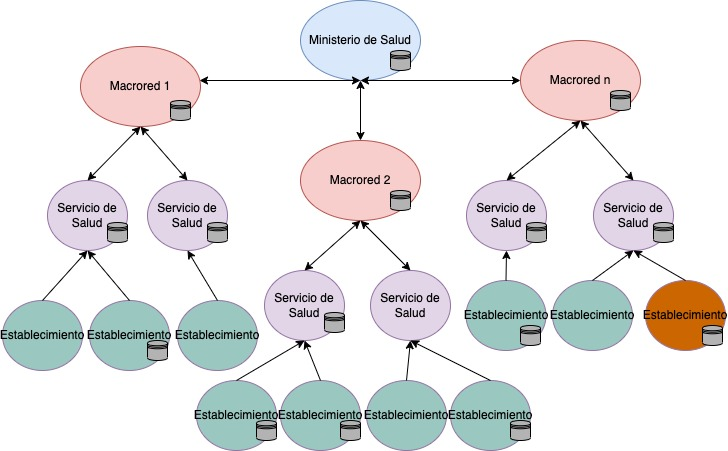

# Introducción

Para lograr la interoperabilidad se define una estrategia tecnológica de la información basada en un modelo de gobernanza transversal, estándares de interoperabilidad definidos y estableciendo un modelo híbrido (centralizado-distribuido) para el manejo de activos de información que permita la movilidad de la información al interior de la red asistencial. Esta estrategia debe ser coherente y sustentable en el tiempo, confiable y resiliente, permitiendo la mitigación de los riesgos para el logro de los objetivos planteados.  

La responsabilidad de ejecutar estos lineamientos de Interoperabilidad descansa principalmente en el Departamento de Tecnologías de la Información y Comunicaciones del Ministerio de Salud, además de los Departamentos de TICS de los Servicios de Salud.  

La dimensión estratégica del modelo de gobernanza de interoperabilidad en salud recae en una comisión de nivel directivo conformada por un representante de la Subsecretaría de Salud Pública, un representante de la Subsecretaría de Redes Asistenciales, un representante del Departamento de Estadísticas e Información en Salud (DEIS), un representante del Departamento de Tecnologías de la Información y las Comunicaciones, un representante del Departamento de Salud Digital y es presidida por el o la Ministro(a) de Salud o quien él o ella delegue. Esta comisión considerará las estrategias prioritarias, procesos de inversión, asuntos que requieran colaboración del intersector y estará a cargo de la toma de decisiones de largo plazo.  

La implementación de procesos clínicos interoperables será coordinada por un comité conformado por representantes del Departamento TIC que velarán por la dimensión técnica y funcional o sintáctica, por representantes del equipo del Departamento de Estadísticas e Información en Salud que velarán por la dimensión semántica y por los representes de las áreas técnicas de cada proceso clínico que velarán por su dimensión organizacional. Como resultado del trabajo coordinado de estos equipos se desarrollarán normas técnicas, guías de implementación y procesos de control de la adopción de estándares.  
