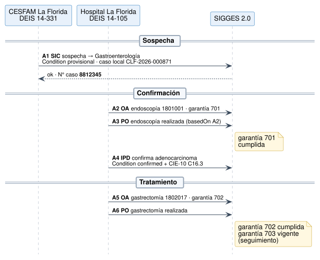
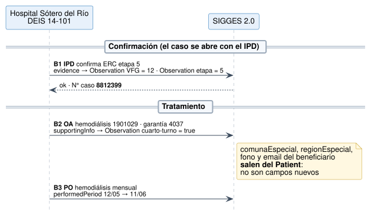
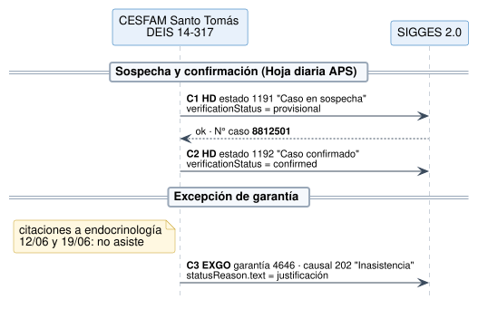
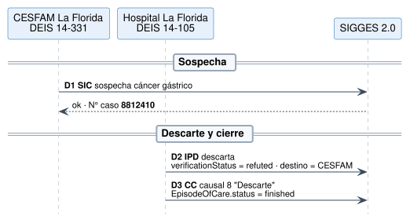

# Ejemplos - Notificación de Casos GES a SIGGES 2.0 v0.4.0

* [**Table of Contents**](toc.md)
* **Ejemplos**

## Ejemplos

Los ejemplos cubren **4 pacientes ficticios**, los **7 tipos de documento** y las situaciones típicas: apertura por SIC, IPD o HD, confirmación, descarte, tratamiento, excepción, cierre, respuestas y consulta. Todos pasan la validación contra los perfiles y generan un JSON v1.5 con **todos** los campos obligatorios de la API (verificado en la 0.4.0 con `tools/fhir2sigges.py`).

### Caso A — Cáncer gástrico: ciclo completo

Juan Carlos Pérez Soto · PS 27, rama 108 · CESFAM La Florida → Hospital La Florida.



| | | | |
| :--- | :--- | :--- | :--- |
| A1 | [SIC](Bundle-msg-a1-sic.md) | [ServiceRequest](ServiceRequest-sic-a.md)+[Condition sospecha](Condition-cond-a-sospecha.md) | Apertura con caso local; respuesta[OK con N° SIGGES](Bundle-resp-a1-ok.md) |
| A2 | [OA](Bundle-msg-a2-oa.md) | [Endoscopía](ServiceRequest-oa-a-endoscopia.md) | Garantía 701, especialidad de destino de apoyo diagnóstico |
| A3 | [PO](Bundle-msg-a3-po.md) | [Procedure](Procedure-po-a-endoscopia.md) | `basedOn`→ OA; rol sin profesional;[reenvío idempotente](Bundle-resp-duplicado.md) |
| A4 | [IPD](Bundle-msg-a4-ipd.md) | [Condition confirmed](Condition-ipd-a.md) | Coding CIE-10 adicional (crecimiento) |
| A5 | [OA](Bundle-msg-a5-oa.md) | [Gastrectomía](ServiceRequest-oa-a-cirugia.md) | Garantía 702 |
| A6 | [PO](Bundle-msg-a6-po.md) | [Procedure](Procedure-po-a-cirugia.md) | Cumple la garantía 702 |

### Caso B — ERC etapa 5: datos especiales

María Isabel González Rojas · PS 1, rama 125 · Hospital Sótero del Río.



| | | |
| :--- | :--- | :--- |
| B1 | [IPD](Bundle-msg-b1-ipd.md) | Caso abierto directamente por IPD;[VFG](Observation-obs-b-vfg.md)y[etapa](Observation-obs-b-etapa.md)como Observation |
| B2 | [OA](Bundle-msg-b2-oa.md) | [Cuarto turno](Observation-obs-b-cuarto-turno.md)en`supportingInfo`; comuna, fono y email del Patient;[respuesta con información](Bundle-resp-b2-aviso.md) |
| B3 | [PO](Bundle-msg-b3-po.md) | Tratamiento mensual con`performedPeriod.end`= fechaFin |

### Caso C — Diabetes tipo 2 en APS

Luis Alberto Muñoz Díaz · PS 7, rama 129 · CESFAM Santo Tomás.



| | | |
| :--- | :--- | :--- |
| C1 | [HD](Bundle-msg-c1-hd.md) | Estado 1191 (sospecha) =`provisional` |
| C2 | [HD](Bundle-msg-c2-hd.md) | Estado 1192 (confirmado) =`confirmed` |
| C3 | [EXGO](Bundle-msg-c3-exgo.md) | Garantía 4646, causal 202 Inasistencia, con justificación |

### Caso D — Sospecha descartada

Rosa Elena Tapia Vidal · PS 27 · CESFAM La Florida → Hospital La Florida.



| | | |
| :--- | :--- | :--- |
| D1 | [SIC](Bundle-msg-d1-sic.md) | Mismo flujo de entrada que el caso A |
| D2 | [IPD](Bundle-msg-d2-ipd.md) | `refuted`(descarta), destino de vuelta a APS |
| D3 | [CC](Bundle-msg-d3-cc.md) | Causal 8 Descarte; EpisodeOfCare`finished` |

### Los casos como ejemplos independientes

Cada caso GES se publica también por sí mismo, para que los diagnósticos, órdenes, prestaciones y tareas sueltos lo puedan referenciar: [caso A](EpisodeOfCare-caso-a.md), [caso B](EpisodeOfCare-caso-b.md), [caso C](EpisodeOfCare-caso-c.md), [caso D](EpisodeOfCare-caso-d.md) y el [caso 8812345](EpisodeOfCare-8812345.md), que es el caso A tal como lo devuelve SIGGES en la consulta. Cada uno muestra el último estado del caso en su secuencia de mensajes.

### Respuestas y consulta

* [OK con número de caso](Bundle-resp-a1-ok.md)
* [OK con información](Bundle-resp-b2-aviso.md)
* [Error de validación](Bundle-resp-error.md): rama que no pertenece al PS y garantía faltante.
* [Reenvío idempotente](Bundle-resp-duplicado.md)
* [Consulta de casos por RUN](Bundle-consulta-casos-pac-a.md), con garantías y plazos.

### El mismo mensaje en la API v1.5

Cada Bundle tiene su equivalente JSON v1.5, generado por el [traductor de referencia](traduccion.md). Dos ejemplos:

**A1 · SIC** → `POST /interoperabilidad/sigges/documentos/sic/registrar`

```
{
  "comunaDirPaciente": "13110",
  "confirmaSospechaDescarta": "S",
  "deisEstablecimientoDestino": "14-105",
  "deisEstablecimientoOtorga": "14-331",
  "deisOrigen": "14-331",
  "deisServicioSaludDestino": "14",
  "deisServicioSaludOtorga": "14",
  "derivadaPara": "1",
  "diagnostico": "Sospecha de cáncer gástrico",
  "direccionPaciente": "Av. Vicuña Mackenna 7110, depto 402",
  "dvPaciente": "3",
  "dvProfesional": "7",
  "especialidadDestino": "07-105-2",
  "especialidadOrigen": "07-900-1",
  "fechaInicioDocumento": "02/03/2026",
  "fechaNacimientoPaciente": "14/03/1961",
  "folioDocumentoHospital": "SIC-CLF-2026-000871",
  "fonoPaciente": "+56 9 8123 4567",
  "fundamentoDiag": "Epigastralgia persistente de 4 meses, baja de peso de 8 kg, anemia ferropénica (Hb 10,1 g/dL).",
  "horaInicioDocumento": "10:15",
  "indicacionExamen": "Omeprazol 20 mg cada 12 h. Control en APS con resultado de endoscopía.",
  "nombrePaciente": "Juan Carlos",
  "nombreSistemaOrigen": "RAYEN_APS",
  "nombresProfesional": "Camila Andrea",
  "primerApellidoPaciente": "Pérez",
  "primerApellidoProfesional": "Rojas",
  "problemaSalud": "27",
  "ramaProblemaSalud": "108",
  "regionDirPaciente": "13",
  "runPaciente": "9876543",
  "runProfesional": "15934286",
  "segundoApellidoPaciente": "Soto",
  "segundoApellidoProfesional": "Muñoz",
  "sexoPaciente": "2",
  "tipoDeisOrigen": "PUBLICO"
}

```

**B2 · OA con datos especiales** → `POST /interoperabilidad/sigges/documentos/ordenatencion/registrar`

```
{
  "codigoPrestacion": "1901029",
  "comunaEspecial": "13201",
  "cuartoTurnoEspecial": "S",
  "deisEstablecimientoDestino": "14-101",
  "deisEstablecimientoOtorga": "14-101",
  "deisOrigen": "14-101",
  "deisServicioSaludDestino": "14",
  "deisServicioSaludOtorga": "14",
  "derivadaPara": "7",
  "diagnostico": "ERC etapa 5",
  "dvPaciente": "6",
  "dvProfesional": "0",
  "emailBeneficiarioEspecial": "maria.gonzalez@correo.cl",
  "especialidadDestino": "07-108-2",
  "especialidadOrigen": "07-108-2",
  "fechaInicioDocumento": "06/05/2026",
  "folioDocumentoHospital": "OA-SR-2026-002218",
  "fonoBeneficiarioEspecial": "+56 9 7788 1122",
  "garantia": "4037",
  "horaInicioDocumento": "15:00",
  "nombrePrestacion": "HEMODIALISIS CON BICARBONATO CON INSUMOS(TRATAMIENTO MENSUAL)",
  "nombreSistemaOrigen": "SISTEMA_HOSPITAL",
  "nombresPaciente": "María Isabel",
  "nombresProfesional": "Valentina",
  "primerApellidoPaciente": "González",
  "primerApellidoProfesional": "Soto",
  "problemaSalud": "1",
  "ramaProblemaSalud": "125",
  "regionEspecial": "13",
  "runPaciente": "7654321",
  "runProfesional": "14209771",
  "segundoApellidoPaciente": "Rojas",
  "segundoApellidoProfesional": "Araya",
  "tipoDeisOrigen": "PUBLICO"
}

```

Los 15 JSON se generan con `tools/fhir2sigges.py --ejemplos` y quedan en `input/includes/api-v15/`; las dos muestras de arriba se incluyen desde ahí, así que no se desalinean del traductor.

