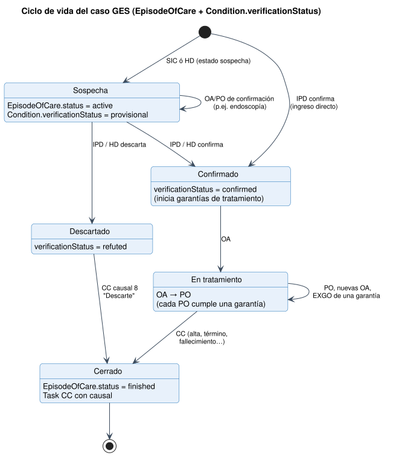
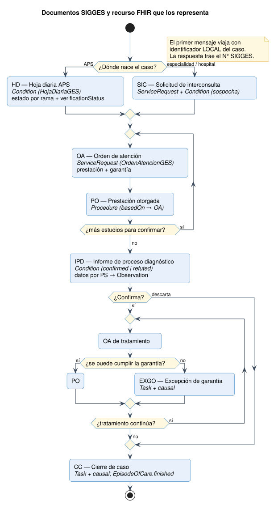
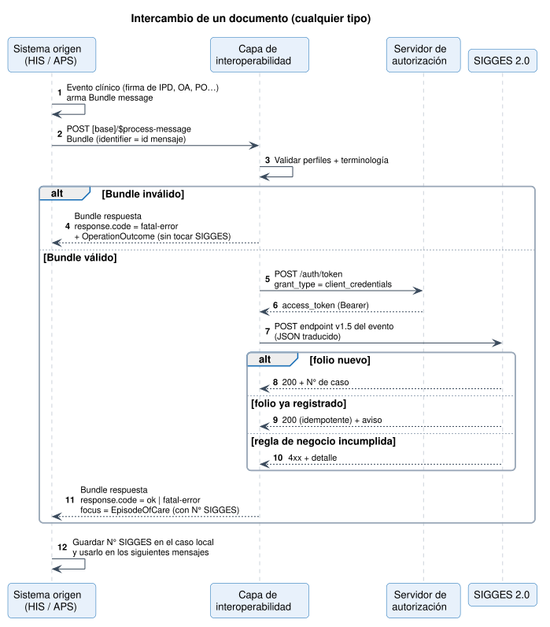
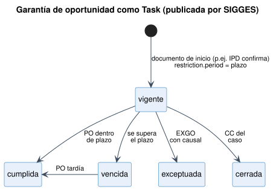

# Flujos del caso GES - Notificación de Casos GES a SIGGES 2.0 v0.4.0

* [**Table of Contents**](toc.md)
* **Flujos del caso GES**

## Flujos del caso GES

Esta página describe el proceso: qué documentos existen, en qué orden ocurren y cómo se intercambia cada uno. El detalle de cada recurso está en [Documento por documento](documentos.md).

### 1. Ciclo de vida del caso {#1-ciclo-de-vida-del-caso}

Un caso GES es un **paciente + un problema de salud + una rama**. En FHIR es un [`EpisodeOfCare` (CasoGES)](StructureDefinition-caso-ges.md). Su estado clínico lo determina el `verificationStatus` del último diagnóstico, y su estado administrativo lo determina `EpisodeOfCare.status`.

| | | | |
| :--- | :--- | :--- | :--- |
| Sospecha | `active` | `provisional` | SIC, HD (estado sospecha) |
| Confirmado | `active` | `confirmed` | IPD, HD (estado confirmado) |
| En tratamiento | `active` | `confirmed` | OA / PO de tratamiento |
| Descartado | `active`hasta el CC | `refuted` | IPD, HD (estado descartado) |
| Cerrado | `finished` | (sin cambio) | CC |

### 2. Documentos y recurso FHIR {#2-documentos-y-recurso-fhir}

| | | | | |
| :--- | :--- | :--- | :--- | :--- |
| Solicitud de interconsulta | 1 | `SIC` | ServiceRequest (+ Condition de sospecha) | [SolicitudInterconsultaGES](StructureDefinition-sic-ges.md) |
| Informe de proceso diagnóstico | 2 | `IPD` | Condition | [InformeProcesoDiagnosticoGES](StructureDefinition-ipd-ges.md) |
| Orden de atención | 3 | `OA` | ServiceRequest | [OrdenAtencionGES](StructureDefinition-oa-ges.md) |
| Prestación otorgada | 10 | `PO` | Procedure | [PrestacionOtorgadaGES](StructureDefinition-po-ges.md) |
| Cierre de caso | 30 | `CC` | Task | [CierreCasoGES](StructureDefinition-cierre-caso-ges.md) |
| Hoja diaria APS | 32 | `HD` | Condition | [HojaDiariaGES](StructureDefinition-hoja-diaria-ges.md) |
| Excepción de garantía de oportunidad | 34 | `EXGO` | Task | [ExcepcionGarantiaGES](StructureDefinition-excepcion-garantia-ges.md) |

### 3. Secuencia de un intercambio {#3-secuencia-de-un-intercambio}

El mismo patrón sirve para los 7 documentos.

**Reglas del flujo**

1. **El primer mensaje abre el caso.**Puede ser una SIC, un IPD o una HD. El`EpisodeOfCare`viaja solo con`identifier[casoLocal]`.
1. **La respuesta devuelve el número SIGGES.**Viene en`MessageHeader.focus`→`EpisodeOfCare.identifier[casoSIGGES]`. El sistema de origen**debe guardarlo**y enviarlo en todos los mensajes siguientes del caso.
1. **Cada documento tiene un folio.**El`identifier[folio]`del recurso foco (`folioDocumentoHospital`) es único por establecimiento y actúa como**clave de idempotencia**: si se reenvía el mismo folio, no se duplica el registro.
1. **Las prestaciones se encadenan.**Una PO referencia la OA que la originó (`Procedure.basedOn`), y una OA puede imputarse a una garantía (`extension[garantia]`).
1. **El orden importa, pero se tolera el desorden.**Si llega una PO antes que su OA, SIGGES puede aceptarla con advertencia. La trazabilidad se reconstruye por`basedOn`y por el caso.

### 4. Garantías de oportunidad {#4-garantías-de-oportunidad}

Las garantías **no las envía el establecimiento**. SIGGES las calcula y las publica como [`Task` (GarantiaOportunidadGES)](StructureDefinition-garantia-oportunidad-ges.md), con su plazo en `restriction.period`. El establecimiento las lee en la [consulta de casos](consulta.md) y actúa sobre ellas con OA, PO o EXGO.

> **Pendiente con FONASA.** El catálogo actual no informa el plazo en días ni, en general, qué documento inicia y cuál cumple cada garantía. Solo 6 de 707 garantías lo indican, y lo hacen dentro del texto. Ver [Observaciones](hallazgos.md).

