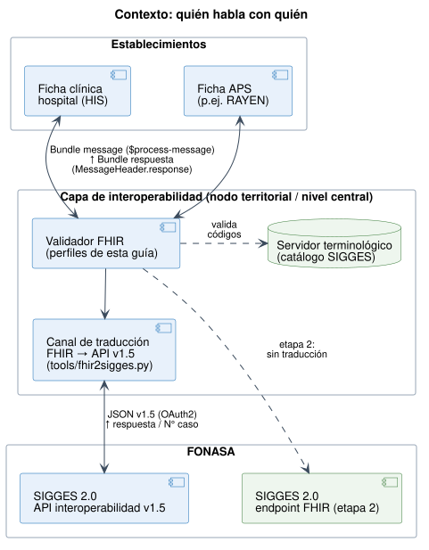

# Inicio - Notificación de Casos GES a SIGGES 2.0 v0.4.0

* [**Table of Contents**](toc.md)
* **Inicio**

## Inicio

| | |
| :--- | :--- |
| *Official URL*:https://interoperabilidad.minsal.cl/fhir/ig/sigges/ImplementationGuide/hl7.fhir.cl.minsal.sigges | *Version*:0.4.0 |
| Draft as of 2026-10-08 | *Computable Name*:NotificacionGESSIGGES |

### Propósito

Esta guía define cómo un establecimiento de salud notifica a **SIGGES 2.0 (FONASA)** los documentos del ciclo de un caso GES, usando **mensajería FHIR R4**. Reemplaza el enfoque de la versión 0.1.0, basada en `QuestionnaireResponse`, que emulaba las pantallas de notificación. En su lugar, esta versión modela el **caso GES** y los **hechos clínicos** que lo componen.



### La idea en tres líneas

1. **Un mensaje por documento.**SIC, IPD, OA, PO, CC, EXGO y HD viajan cada uno como un`Bundle`de tipo`message`. El documento se identifica en`MessageHeader.eventCoding`.
1. **Un núcleo común que no cambia.**Todos los mensajes llevan los mismos cinco recursos:`Patient`,`PractitionerRole`,`Practitioner`,`Organization`y el caso GES (`EpisodeOfCare`). Un implementador los construye una sola vez.
1. **Un recurso foco por documento.**Cada documento usa un recurso FHIR estándar:
* SIC y OA → `ServiceRequest`
* IPD y HD → `Condition`
* PO → `Procedure`
* CC y EXGO → `Task`

### Principios de diseño

| | |
| :--- | :--- |
| **Sencilla** | 9 tipos de recurso, 5 extensiones y ningún recurso a medida. Los perfiles por documento son restricciones delgadas sobre recursos base,[CL Core](https://hl7chile.cl/fhir/ig/clcore/)y[NID](https://interoperabilidad.minsal.cl/fhir/ig/nid/). |
| **Puede crecer** | Hay tres ejes de crecimiento que no rompen nada: un documento nuevo, un dato nuevo por problema de salud ([Observation](StructureDefinition-dato-especial-ges.md)) y un catálogo nuevo ([CodeSystem versionado](terminologia.md)). Ver[Modelo](modelo.md#crecimiento). |
| **Semántica, no pantallas** | `confirmaSospechaDescarta`pasa a ser`Condition.verificationStatus`, la causal es`Task.statusReason`y la prestación es`Procedure.code`. |
| **El caso es el hilo** | Todos los documentos apuntan al mismo`EpisodeOfCare`. Hoy SIGGES infiere el caso por RUN + problema de salud; con esta guía viaja explícito. |
| **Transición sin fricción** | FONASA no necesita cambiar su API el primer día. Un[traductor de referencia](traduccion.md)convierte cada Bundle al JSON de la API v1.5, y ya está probado con los 15 mensajes de ejemplo. |

### Contenido de la guía

* [Flujos del caso GES](flujos.md): ciclo de vida, documentos, secuencia del intercambio y garantías.
* [Modelo de datos](modelo.md): perfiles, relaciones y cómo crece el modelo.
* [Mensajería y respuesta](mensajeria.md): sobre, identificadores, idempotencia, errores y seguridad.
* [Documento por documento](documentos.md): mapeo campo a campo entre la API v1.5 y FHIR.
* [Consulta de casos](consulta.md): reemplazo de `/consultar-sigges`.
* [Terminología](terminologia.md): catálogo FONASA convertido en 13 CodeSystems.
* [Casos de ejemplo](ejemplos.md): 4 pacientes, 15 mensajes, 4 respuestas y una consulta.
* [Transición y traducción](traduccion.md): cómo operar hoy sobre la API v1.5.
* [Observaciones a la API v1.5 y al catálogo](hallazgos.md).

### Estado

Versión 0.4.0, borrador (`draft`) para revisión conjunta de MINSAL y FONASA. Depende de **CL Core 1.9.4** y de **NID 0.4.9**, la base común de las guías del área de Historia Clínica Compartida. Los valores de `confirmaSospechaDescarta`, el formato DEIS y el URI nacional del RUN están marcados como **pendientes de acuerdo**. Los cambios respecto de la 0.2.0 están en el [historial de cambios](historial-de-cambios.md).

**Autoría y créditos.** Se basa en el trabajo previo de la guía **Notificación de Caso GES** v0.1.0 (César Galindo, HL7 Chile; María José Villarroel y Roxana Mercado, FONASA) y en el **Documento de Interoperabilidad SIGGES 2.0** v1.5 (FONASA).


## Resource Content

```json
{
  "resourceType" : "ImplementationGuide",
  "id" : "hl7.fhir.cl.minsal.sigges",
  "language" : "es-CL",
  "url" : "https://interoperabilidad.minsal.cl/fhir/ig/sigges/ImplementationGuide/hl7.fhir.cl.minsal.sigges",
  "version" : "0.4.0",
  "name" : "NotificacionGESSIGGES",
  "title" : "Notificación de Casos GES a SIGGES 2.0",
  "status" : "draft",
  "date" : "2026-10-08T15:37:06-03:00",
  "publisher" : "Unidad de Interoperabilidad - MINSAL",
  "contact" : [{
    "name" : "Unidad de Interoperabilidad - MINSAL",
    "telecom" : [{
      "system" : "url",
      "value" : "https://interoperabilidad.minsal.cl"
    }]
  }],
  "description" : "Guía FHIR R4 para notificar los documentos del ciclo de un caso GES (SIC, IPD, OA, PO, CC, EXGO, HD APS) desde los establecimientos hacia SIGGES 2.0 de FONASA, usando mensajería FHIR con un núcleo común de recursos y un recurso foco por documento.",
  "jurisdiction" : [{
    "coding" : [{
      "system" : "urn:iso:std:iso:3166",
      "code" : "CL",
      "display" : "Chile"
    }]
  }],
  "packageId" : "hl7.fhir.cl.minsal.sigges",
  "license" : "CC0-1.0",
  "fhirVersion" : ["4.0.1"],
  "dependsOn" : [{
    "id" : "hl7tx",
    "extension" : [{
      "url" : "http://hl7.org/fhir/tools/StructureDefinition/implementationguide-dependency-comment",
      "valueMarkdown" : "Automatically added as a dependency - all IGs depend on HL7 Terminology"
    }],
    "uri" : "http://terminology.hl7.org/ImplementationGuide/hl7.terminology",
    "packageId" : "hl7.terminology.r4",
    "version" : "7.4.0"
  },
  {
    "id" : "hl7ext",
    "extension" : [{
      "url" : "http://hl7.org/fhir/tools/StructureDefinition/implementationguide-dependency-comment",
      "valueMarkdown" : "Automatically added as a dependency - all IGs depend on the HL7 Extension Pack"
    }],
    "uri" : "http://hl7.org/fhir/extensions/ImplementationGuide/hl7.fhir.uv.extensions",
    "packageId" : "hl7.fhir.uv.extensions.r4",
    "version" : "5.3.0"
  },
  {
    "id" : "hl7_fhir_cl_clcore",
    "uri" : "https://hl7chile.cl/fhir/ig/clcore/ImplementationGuide/hl7.fhir.cl.clcore",
    "packageId" : "hl7.fhir.cl.clcore",
    "version" : "1.9.4"
  },
  {
    "id" : "hl7_fhir_cl_minsal_nid",
    "uri" : "https://interoperabilidad.minsal.cl/fhir/ig/nid/ImplementationGuide/hl7.fhir.cl.minsal.nid",
    "packageId" : "hl7.fhir.cl.minsal.nid",
    "version" : "0.4.9"
  }],
  "definition" : {
    "extension" : [{
      "url" : "http://hl7.org/fhir/tools/StructureDefinition/ig-internal-dependency",
      "valueCode" : "hl7.fhir.uv.tools.r4#1.3.0"
    },
    {
      "extension" : [{
        "url" : "code",
        "valueCode" : "copyrightyear"
      },
      {
        "url" : "value",
        "valueString" : "2026+"
      }],
      "url" : "http://hl7.org/fhir/tools/StructureDefinition/ig-parameter"
    },
    {
      "extension" : [{
        "url" : "code",
        "valueCode" : "releaselabel"
      },
      {
        "url" : "value",
        "valueString" : "ci-build"
      }],
      "url" : "http://hl7.org/fhir/tools/StructureDefinition/ig-parameter"
    },
    {
      "extension" : [{
        "url" : "code",
        "valueCode" : "autoload-resources"
      },
      {
        "url" : "value",
        "valueString" : "true"
      }],
      "url" : "http://hl7.org/fhir/tools/StructureDefinition/ig-parameter"
    },
    {
      "extension" : [{
        "url" : "code",
        "valueCode" : "path-liquid"
      },
      {
        "url" : "value",
        "valueString" : "template/liquid"
      }],
      "url" : "http://hl7.org/fhir/tools/StructureDefinition/ig-parameter"
    },
    {
      "extension" : [{
        "url" : "code",
        "valueCode" : "path-liquid"
      },
      {
        "url" : "value",
        "valueString" : "input/liquid"
      }],
      "url" : "http://hl7.org/fhir/tools/StructureDefinition/ig-parameter"
    },
    {
      "extension" : [{
        "url" : "code",
        "valueCode" : "path-qa"
      },
      {
        "url" : "value",
        "valueString" : "temp/qa"
      }],
      "url" : "http://hl7.org/fhir/tools/StructureDefinition/ig-parameter"
    },
    {
      "extension" : [{
        "url" : "code",
        "valueCode" : "path-temp"
      },
      {
        "url" : "value",
        "valueString" : "temp/pages"
      }],
      "url" : "http://hl7.org/fhir/tools/StructureDefinition/ig-parameter"
    },
    {
      "extension" : [{
        "url" : "code",
        "valueCode" : "path-output"
      },
      {
        "url" : "value",
        "valueString" : "output"
      }],
      "url" : "http://hl7.org/fhir/tools/StructureDefinition/ig-parameter"
    },
    {
      "extension" : [{
        "url" : "code",
        "valueCode" : "path-suppressed-warnings"
      },
      {
        "url" : "value",
        "valueString" : "input/ignoreWarnings.txt"
      }],
      "url" : "http://hl7.org/fhir/tools/StructureDefinition/ig-parameter"
    },
    {
      "extension" : [{
        "url" : "code",
        "valueCode" : "path-history"
      },
      {
        "url" : "value",
        "valueString" : "https://interoperabilidad.minsal.cl/fhir/ig/sigges/history.html"
      }],
      "url" : "http://hl7.org/fhir/tools/StructureDefinition/ig-parameter"
    },
    {
      "extension" : [{
        "url" : "code",
        "valueCode" : "template-html"
      },
      {
        "url" : "value",
        "valueString" : "template-page.html"
      }],
      "url" : "http://hl7.org/fhir/tools/StructureDefinition/ig-parameter"
    },
    {
      "extension" : [{
        "url" : "code",
        "valueCode" : "template-md"
      },
      {
        "url" : "value",
        "valueString" : "template-page-md.html"
      }],
      "url" : "http://hl7.org/fhir/tools/StructureDefinition/ig-parameter"
    },
    {
      "extension" : [{
        "url" : "code",
        "valueCode" : "apply-contact"
      },
      {
        "url" : "value",
        "valueString" : "true"
      }],
      "url" : "http://hl7.org/fhir/tools/StructureDefinition/ig-parameter"
    },
    {
      "extension" : [{
        "url" : "code",
        "valueCode" : "apply-context"
      },
      {
        "url" : "value",
        "valueString" : "true"
      }],
      "url" : "http://hl7.org/fhir/tools/StructureDefinition/ig-parameter"
    },
    {
      "extension" : [{
        "url" : "code",
        "valueCode" : "apply-copyright"
      },
      {
        "url" : "value",
        "valueString" : "true"
      }],
      "url" : "http://hl7.org/fhir/tools/StructureDefinition/ig-parameter"
    },
    {
      "extension" : [{
        "url" : "code",
        "valueCode" : "apply-jurisdiction"
      },
      {
        "url" : "value",
        "valueString" : "true"
      }],
      "url" : "http://hl7.org/fhir/tools/StructureDefinition/ig-parameter"
    },
    {
      "extension" : [{
        "url" : "code",
        "valueCode" : "apply-license"
      },
      {
        "url" : "value",
        "valueString" : "true"
      }],
      "url" : "http://hl7.org/fhir/tools/StructureDefinition/ig-parameter"
    },
    {
      "extension" : [{
        "url" : "code",
        "valueCode" : "apply-publisher"
      },
      {
        "url" : "value",
        "valueString" : "true"
      }],
      "url" : "http://hl7.org/fhir/tools/StructureDefinition/ig-parameter"
    },
    {
      "extension" : [{
        "url" : "code",
        "valueCode" : "apply-version"
      },
      {
        "url" : "value",
        "valueString" : "true"
      }],
      "url" : "http://hl7.org/fhir/tools/StructureDefinition/ig-parameter"
    },
    {
      "extension" : [{
        "url" : "code",
        "valueCode" : "apply-wg"
      },
      {
        "url" : "value",
        "valueString" : "true"
      }],
      "url" : "http://hl7.org/fhir/tools/StructureDefinition/ig-parameter"
    },
    {
      "extension" : [{
        "url" : "code",
        "valueCode" : "active-tables"
      },
      {
        "url" : "value",
        "valueString" : "true"
      }],
      "url" : "http://hl7.org/fhir/tools/StructureDefinition/ig-parameter"
    },
    {
      "extension" : [{
        "url" : "code",
        "valueCode" : "fmm-definition"
      },
      {
        "url" : "value",
        "valueString" : "http://hl7.org/fhir/versions.html#maturity"
      }],
      "url" : "http://hl7.org/fhir/tools/StructureDefinition/ig-parameter"
    },
    {
      "extension" : [{
        "url" : "code",
        "valueCode" : "propagate-status"
      },
      {
        "url" : "value",
        "valueString" : "true"
      }],
      "url" : "http://hl7.org/fhir/tools/StructureDefinition/ig-parameter"
    },
    {
      "extension" : [{
        "url" : "code",
        "valueCode" : "excludelogbinaryformat"
      },
      {
        "url" : "value",
        "valueString" : "true"
      }],
      "url" : "http://hl7.org/fhir/tools/StructureDefinition/ig-parameter"
    },
    {
      "extension" : [{
        "url" : "code",
        "valueCode" : "tabbed-snapshots"
      },
      {
        "url" : "value",
        "valueString" : "true"
      }],
      "url" : "http://hl7.org/fhir/tools/StructureDefinition/ig-parameter"
    }],
    "resource" : [{
      "extension" : [{
        "url" : "http://hl7.org/fhir/tools/StructureDefinition/resource-information",
        "valueString" : "StructureDefinition:resource"
      },
      {
        "url" : "http://hl7.org/fhir/StructureDefinition/implementationguide-page",
        "valueUri" : "StructureDefinition-bundle-notificacion-ges.html"
      }],
      "reference" : {
        "reference" : "StructureDefinition/bundle-notificacion-ges"
      },
      "name" : "Bundle — Notificación GES",
      "description" : "Sobre de un documento SIGGES: MessageHeader + núcleo común (Patient, PractitionerRole, Practitioner, Organization, EpisodeOfCare) + recurso foco + Observation opcionales. Se envía a $process-message.",
      "exampleBoolean" : false
    },
    {
      "extension" : [{
        "url" : "http://hl7.org/fhir/tools/StructureDefinition/resource-information",
        "valueString" : "StructureDefinition:resource"
      },
      {
        "url" : "http://hl7.org/fhir/StructureDefinition/implementationguide-page",
        "valueUri" : "StructureDefinition-bundle-respuesta-ges.html"
      }],
      "reference" : {
        "reference" : "StructureDefinition/bundle-respuesta-ges"
      },
      "name" : "Bundle — Respuesta SIGGES",
      "description" : "Respuesta a una notificación.",
      "exampleBoolean" : false
    },
    {
      "extension" : [{
        "url" : "http://hl7.org/fhir/tools/StructureDefinition/resource-information",
        "valueString" : "EpisodeOfCare"
      },
      {
        "url" : "http://hl7.org/fhir/StructureDefinition/implementationguide-page",
        "valueUri" : "EpisodeOfCare-8812345.html"
      }],
      "reference" : {
        "reference" : "EpisodeOfCare/8812345"
      },
      "name" : "Caso 8812345 en SIGGES (vista del receptor)",
      "description" : "El caso A tal como lo devuelve SIGGES en la consulta; las garantías gar-a-701 a 703 lo referencian (SG-01).",
      "exampleCanonical" : "https://interoperabilidad.minsal.cl/fhir/ig/sigges/StructureDefinition/caso-ges"
    },
    {
      "extension" : [{
        "url" : "http://hl7.org/fhir/tools/StructureDefinition/resource-information",
        "valueString" : "ServiceRequest"
      },
      {
        "url" : "http://hl7.org/fhir/StructureDefinition/implementationguide-page",
        "valueUri" : "ServiceRequest-sic-a.html"
      }],
      "reference" : {
        "reference" : "ServiceRequest/sic-a"
      },
      "name" : "Caso A · 1 — SIC con sospecha de cáncer gástrico",
      "description" : "CESFAM La Florida deriva a Gastroenterología del Hospital La Florida para confirmación diagnóstica.",
      "exampleCanonical" : "https://interoperabilidad.minsal.cl/fhir/ig/sigges/StructureDefinition/sic-ges"
    },
    {
      "extension" : [{
        "url" : "http://hl7.org/fhir/tools/StructureDefinition/resource-information",
        "valueString" : "ServiceRequest"
      },
      {
        "url" : "http://hl7.org/fhir/StructureDefinition/implementationguide-page",
        "valueUri" : "ServiceRequest-oa-a-endoscopia.html"
      }],
      "reference" : {
        "reference" : "ServiceRequest/oa-a-endoscopia"
      },
      "name" : "Caso A · 2 — OA de endoscopía digestiva alta",
      "description" : "Gastroenterología ordena gastroduodenoscopía con biopsia para confirmar.",
      "exampleCanonical" : "https://interoperabilidad.minsal.cl/fhir/ig/sigges/StructureDefinition/oa-ges"
    },
    {
      "extension" : [{
        "url" : "http://hl7.org/fhir/tools/StructureDefinition/resource-information",
        "valueString" : "Procedure"
      },
      {
        "url" : "http://hl7.org/fhir/StructureDefinition/implementationguide-page",
        "valueUri" : "Procedure-po-a-endoscopia.html"
      }],
      "reference" : {
        "reference" : "Procedure/po-a-endoscopia"
      },
      "name" : "Caso A · 3 — PO endoscopía realizada",
      "description" : "La unidad de endoscopía registra la prestación. PO no exige profesional: el rol no trae practitioner.",
      "exampleCanonical" : "https://interoperabilidad.minsal.cl/fhir/ig/sigges/StructureDefinition/po-ges"
    },
    {
      "extension" : [{
        "url" : "http://hl7.org/fhir/tools/StructureDefinition/resource-information",
        "valueString" : "Condition"
      },
      {
        "url" : "http://hl7.org/fhir/StructureDefinition/implementationguide-page",
        "valueUri" : "Condition-ipd-a.html"
      }],
      "reference" : {
        "reference" : "Condition/ipd-a"
      },
      "name" : "Caso A · 4 — IPD confirma cáncer gástrico",
      "description" : "verificationStatus = confirmed. Incluye además un coding CIE-10 (crecimiento sin cambiar el perfil).",
      "exampleCanonical" : "https://interoperabilidad.minsal.cl/fhir/ig/sigges/StructureDefinition/ipd-ges"
    },
    {
      "extension" : [{
        "url" : "http://hl7.org/fhir/tools/StructureDefinition/resource-information",
        "valueString" : "ServiceRequest"
      },
      {
        "url" : "http://hl7.org/fhir/StructureDefinition/implementationguide-page",
        "valueUri" : "ServiceRequest-oa-a-cirugia.html"
      }],
      "reference" : {
        "reference" : "ServiceRequest/oa-a-cirugia"
      },
      "name" : "Caso A · 5 — OA de gastrectomía",
      "description" : "Cirugía digestiva ordena gastrectomía subtotal con disección ganglionar.",
      "exampleCanonical" : "https://interoperabilidad.minsal.cl/fhir/ig/sigges/StructureDefinition/oa-ges"
    },
    {
      "extension" : [{
        "url" : "http://hl7.org/fhir/tools/StructureDefinition/resource-information",
        "valueString" : "Procedure"
      },
      {
        "url" : "http://hl7.org/fhir/StructureDefinition/implementationguide-page",
        "valueUri" : "Procedure-po-a-cirugia.html"
      }],
      "reference" : {
        "reference" : "Procedure/po-a-cirugia"
      },
      "name" : "Caso A · 6 — PO gastrectomía realizada",
      "description" : "Cumple la garantía de intervención quirúrgica.",
      "exampleCanonical" : "https://interoperabilidad.minsal.cl/fhir/ig/sigges/StructureDefinition/po-ges"
    },
    {
      "extension" : [{
        "url" : "http://hl7.org/fhir/tools/StructureDefinition/resource-information",
        "valueString" : "EpisodeOfCare"
      },
      {
        "url" : "http://hl7.org/fhir/StructureDefinition/implementationguide-page",
        "valueUri" : "EpisodeOfCare-caso-a.html"
      }],
      "reference" : {
        "reference" : "EpisodeOfCare/caso-a"
      },
      "name" : "Caso A — cáncer gástrico (estado tras la PO de cirugía)",
      "description" : "Caso GES del paciente A publicado como ejemplo independiente, para que los ejemplos sueltos que lo referencian resuelvan (SG-01).",
      "exampleCanonical" : "https://interoperabilidad.minsal.cl/fhir/ig/sigges/StructureDefinition/caso-ges"
    },
    {
      "extension" : [{
        "url" : "http://hl7.org/fhir/tools/StructureDefinition/resource-information",
        "valueString" : "Condition"
      },
      {
        "url" : "http://hl7.org/fhir/StructureDefinition/implementationguide-page",
        "valueUri" : "Condition-cond-a-sospecha.html"
      }],
      "reference" : {
        "reference" : "Condition/cond-a-sospecha"
      },
      "name" : "Caso A — Diagnóstico de sospecha (motivo de la SIC)",
      "description" : "Condition en estado provisional = sospecha GES.",
      "exampleCanonical" : "https://interoperabilidad.minsal.cl/fhir/ig/sigges/StructureDefinition/diagnostico-ges"
    },
    {
      "extension" : [{
        "url" : "http://hl7.org/fhir/tools/StructureDefinition/resource-information",
        "valueString" : "Condition"
      },
      {
        "url" : "http://hl7.org/fhir/StructureDefinition/implementationguide-page",
        "valueUri" : "Condition-ipd-b.html"
      }],
      "reference" : {
        "reference" : "Condition/ipd-b"
      },
      "name" : "Caso B · 1 — IPD confirma ERC etapa 5",
      "description" : "La VFG y la etapa viajan como DatoEspecialGES en evidence.detail (reemplazan enfermedadRenalVfg1..3).",
      "exampleCanonical" : "https://interoperabilidad.minsal.cl/fhir/ig/sigges/StructureDefinition/ipd-ges"
    },
    {
      "extension" : [{
        "url" : "http://hl7.org/fhir/tools/StructureDefinition/resource-information",
        "valueString" : "ServiceRequest"
      },
      {
        "url" : "http://hl7.org/fhir/StructureDefinition/implementationguide-page",
        "valueUri" : "ServiceRequest-oa-b-hemodialisis.html"
      }],
      "reference" : {
        "reference" : "ServiceRequest/oa-b-hemodialisis"
      },
      "name" : "Caso B · 2 — OA de hemodiálisis",
      "description" : "Orden de hemodiálisis con cuarto turno. Comuna, fono y email del beneficiario salen del Patient (no son campos especiales).",
      "exampleCanonical" : "https://interoperabilidad.minsal.cl/fhir/ig/sigges/StructureDefinition/oa-ges"
    },
    {
      "extension" : [{
        "url" : "http://hl7.org/fhir/tools/StructureDefinition/resource-information",
        "valueString" : "Procedure"
      },
      {
        "url" : "http://hl7.org/fhir/StructureDefinition/implementationguide-page",
        "valueUri" : "Procedure-po-b-hemodialisis.html"
      }],
      "reference" : {
        "reference" : "Procedure/po-b-hemodialisis"
      },
      "name" : "Caso B · 3 — PO hemodiálisis mensual",
      "description" : "Prestación con período: fechaRealizacion = start, fechaFin = end.",
      "exampleCanonical" : "https://interoperabilidad.minsal.cl/fhir/ig/sigges/StructureDefinition/po-ges"
    },
    {
      "extension" : [{
        "url" : "http://hl7.org/fhir/tools/StructureDefinition/resource-information",
        "valueString" : "EpisodeOfCare"
      },
      {
        "url" : "http://hl7.org/fhir/StructureDefinition/implementationguide-page",
        "valueUri" : "EpisodeOfCare-caso-b.html"
      }],
      "reference" : {
        "reference" : "EpisodeOfCare/caso-b"
      },
      "name" : "Caso B — ERC (estado tras la PO de hemodiálisis)",
      "description" : "Caso GES del paciente B publicado como ejemplo independiente (SG-01).",
      "exampleCanonical" : "https://interoperabilidad.minsal.cl/fhir/ig/sigges/StructureDefinition/caso-ges"
    },
    {
      "extension" : [{
        "url" : "http://hl7.org/fhir/tools/StructureDefinition/resource-information",
        "valueString" : "Condition"
      },
      {
        "url" : "http://hl7.org/fhir/StructureDefinition/implementationguide-page",
        "valueUri" : "Condition-hd-c-sospecha.html"
      }],
      "reference" : {
        "reference" : "Condition/hd-c-sospecha"
      },
      "name" : "Caso C · 1 — HD sospecha DM2",
      "description" : "Estado HD 1191 + verificationStatus provisional.",
      "exampleCanonical" : "https://interoperabilidad.minsal.cl/fhir/ig/sigges/StructureDefinition/hoja-diaria-ges"
    },
    {
      "extension" : [{
        "url" : "http://hl7.org/fhir/tools/StructureDefinition/resource-information",
        "valueString" : "Condition"
      },
      {
        "url" : "http://hl7.org/fhir/StructureDefinition/implementationguide-page",
        "valueUri" : "Condition-hd-c-confirmado.html"
      }],
      "reference" : {
        "reference" : "Condition/hd-c-confirmado"
      },
      "name" : "Caso C · 2 — HD confirma DM2",
      "description" : "Estado HD 1192 + verificationStatus confirmed.",
      "exampleCanonical" : "https://interoperabilidad.minsal.cl/fhir/ig/sigges/StructureDefinition/hoja-diaria-ges"
    },
    {
      "extension" : [{
        "url" : "http://hl7.org/fhir/tools/StructureDefinition/resource-information",
        "valueString" : "Task"
      },
      {
        "url" : "http://hl7.org/fhir/StructureDefinition/implementationguide-page",
        "valueUri" : "Task-exgo-c.html"
      }],
      "reference" : {
        "reference" : "Task/exgo-c"
      },
      "name" : "Caso C · 3 — EXGO por inasistencia",
      "description" : "Excepción de la garantía de atención por especialista (endocrinología) por inasistencia.",
      "exampleCanonical" : "https://interoperabilidad.minsal.cl/fhir/ig/sigges/StructureDefinition/excepcion-garantia-ges"
    },
    {
      "extension" : [{
        "url" : "http://hl7.org/fhir/tools/StructureDefinition/resource-information",
        "valueString" : "EpisodeOfCare"
      },
      {
        "url" : "http://hl7.org/fhir/StructureDefinition/implementationguide-page",
        "valueUri" : "EpisodeOfCare-caso-c.html"
      }],
      "reference" : {
        "reference" : "EpisodeOfCare/caso-c"
      },
      "name" : "Caso C — hoja diaria APS (estado tras la EXGO)",
      "description" : "Caso GES del paciente C publicado como ejemplo independiente (SG-01).",
      "exampleCanonical" : "https://interoperabilidad.minsal.cl/fhir/ig/sigges/StructureDefinition/caso-ges"
    },
    {
      "extension" : [{
        "url" : "http://hl7.org/fhir/tools/StructureDefinition/resource-information",
        "valueString" : "ServiceRequest"
      },
      {
        "url" : "http://hl7.org/fhir/StructureDefinition/implementationguide-page",
        "valueUri" : "ServiceRequest-sic-d.html"
      }],
      "reference" : {
        "reference" : "ServiceRequest/sic-d"
      },
      "name" : "Caso D · 1 — SIC sospecha cáncer gástrico",
      "description" : "Segunda paciente con el mismo flujo de entrada que el caso A.",
      "exampleCanonical" : "https://interoperabilidad.minsal.cl/fhir/ig/sigges/StructureDefinition/sic-ges"
    },
    {
      "extension" : [{
        "url" : "http://hl7.org/fhir/tools/StructureDefinition/resource-information",
        "valueString" : "Condition"
      },
      {
        "url" : "http://hl7.org/fhir/StructureDefinition/implementationguide-page",
        "valueUri" : "Condition-ipd-d.html"
      }],
      "reference" : {
        "reference" : "Condition/ipd-d"
      },
      "name" : "Caso D · 2 — IPD descarta",
      "description" : "verificationStatus = refuted (descarta). Destino: retorno a APS.",
      "exampleCanonical" : "https://interoperabilidad.minsal.cl/fhir/ig/sigges/StructureDefinition/ipd-ges"
    },
    {
      "extension" : [{
        "url" : "http://hl7.org/fhir/tools/StructureDefinition/resource-information",
        "valueString" : "Task"
      },
      {
        "url" : "http://hl7.org/fhir/StructureDefinition/implementationguide-page",
        "valueUri" : "Task-cc-d.html"
      }],
      "reference" : {
        "reference" : "Task/cc-d"
      },
      "name" : "Caso D · 3 — CC por descarte",
      "description" : "Cierre de caso con causal 8 (Descarte).",
      "exampleCanonical" : "https://interoperabilidad.minsal.cl/fhir/ig/sigges/StructureDefinition/cierre-caso-ges"
    },
    {
      "extension" : [{
        "url" : "http://hl7.org/fhir/tools/StructureDefinition/resource-information",
        "valueString" : "EpisodeOfCare"
      },
      {
        "url" : "http://hl7.org/fhir/StructureDefinition/implementationguide-page",
        "valueUri" : "EpisodeOfCare-caso-d.html"
      }],
      "reference" : {
        "reference" : "EpisodeOfCare/caso-d"
      },
      "name" : "Caso D — descartado y cerrado (estado tras el CC)",
      "description" : "Caso GES del paciente D publicado como ejemplo independiente (SG-01).",
      "exampleCanonical" : "https://interoperabilidad.minsal.cl/fhir/ig/sigges/StructureDefinition/caso-ges"
    },
    {
      "extension" : [{
        "url" : "http://hl7.org/fhir/tools/StructureDefinition/resource-information",
        "valueString" : "Condition"
      },
      {
        "url" : "http://hl7.org/fhir/StructureDefinition/implementationguide-page",
        "valueUri" : "Condition-cond-d-sospecha.html"
      }],
      "reference" : {
        "reference" : "Condition/cond-d-sospecha"
      },
      "name" : "Caso D — Diagnóstico de sospecha",
      "description" : "Motivo de la SIC del caso D.",
      "exampleCanonical" : "https://interoperabilidad.minsal.cl/fhir/ig/sigges/StructureDefinition/diagnostico-ges"
    },
    {
      "extension" : [{
        "url" : "http://hl7.org/fhir/tools/StructureDefinition/resource-information",
        "valueString" : "StructureDefinition:resource"
      },
      {
        "url" : "http://hl7.org/fhir/StructureDefinition/implementationguide-page",
        "valueUri" : "StructureDefinition-caso-ges.html"
      }],
      "reference" : {
        "reference" : "StructureDefinition/caso-ges"
      },
      "name" : "Caso GES",
      "description" : "El caso GES: paciente + problema de salud + rama. Es el hilo que une todos los documentos. Lo abre la primera notificación (SIC, IPD o HD) y lo cierra un CC.",
      "exampleBoolean" : false
    },
    {
      "extension" : [{
        "url" : "http://hl7.org/fhir/tools/StructureDefinition/resource-information",
        "valueString" : "StructureDefinition:extension"
      },
      {
        "url" : "http://hl7.org/fhir/StructureDefinition/implementationguide-page",
        "valueUri" : "StructureDefinition-ext-caso-ges.html"
      }],
      "reference" : {
        "reference" : "StructureDefinition/ext-caso-ges"
      },
      "name" : "Caso GES",
      "description" : "Referencia al caso GES (EpisodeOfCare) al que pertenece el documento. En R4 ServiceRequest, Procedure y Condition no tienen un elemento para el episodio.",
      "exampleBoolean" : false
    },
    {
      "extension" : [{
        "url" : "http://hl7.org/fhir/tools/StructureDefinition/resource-information",
        "valueString" : "ValueSet"
      },
      {
        "url" : "http://hl7.org/fhir/StructureDefinition/implementationguide-page",
        "valueUri" : "ValueSet-vs-causal-cierre-caso.html"
      }],
      "reference" : {
        "reference" : "ValueSet/vs-causal-cierre-caso"
      },
      "name" : "Causales de cierre de caso",
      "description" : "Causales de tipo cierre-caso.",
      "exampleBoolean" : false
    },
    {
      "extension" : [{
        "url" : "http://hl7.org/fhir/tools/StructureDefinition/resource-information",
        "valueString" : "ValueSet"
      },
      {
        "url" : "http://hl7.org/fhir/StructureDefinition/implementationguide-page",
        "valueUri" : "ValueSet-vs-causal-excepcion-garantia.html"
      }],
      "reference" : {
        "reference" : "ValueSet/vs-causal-excepcion-garantia"
      },
      "name" : "Causales de excepción de garantía",
      "description" : "Causales de tipo excepcion-garantia.",
      "exampleBoolean" : false
    },
    {
      "extension" : [{
        "url" : "http://hl7.org/fhir/tools/StructureDefinition/resource-information",
        "valueString" : "CodeSystem"
      },
      {
        "url" : "http://hl7.org/fhir/StructureDefinition/implementationguide-page",
        "valueUri" : "CodeSystem-causal-sigges.html"
      }],
      "reference" : {
        "reference" : "CodeSystem/causal-sigges"
      },
      "name" : "Causales SIGGES",
      "description" : "Causales de cierre de caso, excepción de garantía y cierre de garantía de oportunidad (hoja CAUSALES).",
      "exampleBoolean" : false
    },
    {
      "extension" : [{
        "url" : "http://hl7.org/fhir/tools/StructureDefinition/resource-information",
        "valueString" : "StructureDefinition:resource"
      },
      {
        "url" : "http://hl7.org/fhir/StructureDefinition/implementationguide-page",
        "valueUri" : "StructureDefinition-cierre-caso-ges.html"
      }],
      "reference" : {
        "reference" : "StructureDefinition/cierre-caso-ges"
      },
      "name" : "CC — Cierre de caso",
      "description" : "Cierre del caso GES con su causal. focus apunta al caso.",
      "exampleBoolean" : false
    },
    {
      "extension" : [{
        "url" : "http://hl7.org/fhir/tools/StructureDefinition/resource-information",
        "valueString" : "Bundle"
      },
      {
        "url" : "http://hl7.org/fhir/StructureDefinition/implementationguide-page",
        "valueUri" : "Bundle-consulta-casos-pac-a.html"
      }],
      "reference" : {
        "reference" : "Bundle/consulta-casos-pac-a"
      },
      "name" : "Consulta de casos por RUN — paciente A",
      "description" : "Respuesta a GET EpisodeOfCare?patient.identifier=…|9876543-3&_revinclude=Task:focus. Reemplaza /consultar-sigges.",
      "exampleBoolean" : true
    },
    {
      "extension" : [{
        "url" : "http://hl7.org/fhir/tools/StructureDefinition/resource-information",
        "valueString" : "NamingSystem"
      },
      {
        "url" : "http://hl7.org/fhir/StructureDefinition/implementationguide-page",
        "valueUri" : "NamingSystem-NSDeis.html"
      }],
      "reference" : {
        "reference" : "NamingSystem/NSDeis"
      },
      "name" : "Código DEIS de establecimiento",
      "description" : "Identificador DEIS de establecimiento en formato NN-NNN (DEIS2 del catálogo UNIDADES).",
      "exampleBoolean" : false
    },
    {
      "extension" : [{
        "url" : "http://hl7.org/fhir/tools/StructureDefinition/resource-information",
        "valueString" : "Observation"
      },
      {
        "url" : "http://hl7.org/fhir/StructureDefinition/implementationguide-page",
        "valueUri" : "Observation-obs-b-etapa.html"
      }],
      "reference" : {
        "reference" : "Observation/obs-b-etapa"
      },
      "name" : "Dato especial — Etapa de enfermedad renal crónica",
      "description" : "Dato específico del problema de salud, enviado como Observation.",
      "exampleCanonical" : "https://interoperabilidad.minsal.cl/fhir/ig/sigges/StructureDefinition/dato-especial-ges"
    },
    {
      "extension" : [{
        "url" : "http://hl7.org/fhir/tools/StructureDefinition/resource-information",
        "valueString" : "Observation"
      },
      {
        "url" : "http://hl7.org/fhir/StructureDefinition/implementationguide-page",
        "valueUri" : "Observation-obs-b-cuarto-turno.html"
      }],
      "reference" : {
        "reference" : "Observation/obs-b-cuarto-turno"
      },
      "name" : "Dato especial — Requiere cuarto turno de diálisis",
      "description" : "Dato específico del problema de salud, enviado como Observation.",
      "exampleCanonical" : "https://interoperabilidad.minsal.cl/fhir/ig/sigges/StructureDefinition/dato-especial-ges"
    },
    {
      "extension" : [{
        "url" : "http://hl7.org/fhir/tools/StructureDefinition/resource-information",
        "valueString" : "Observation"
      },
      {
        "url" : "http://hl7.org/fhir/StructureDefinition/implementationguide-page",
        "valueUri" : "Observation-obs-b-vfg.html"
      }],
      "reference" : {
        "reference" : "Observation/obs-b-vfg"
      },
      "name" : "Dato especial — Velocidad de filtración glomerular estimada",
      "description" : "Dato específico del problema de salud, enviado como Observation.",
      "exampleCanonical" : "https://interoperabilidad.minsal.cl/fhir/ig/sigges/StructureDefinition/dato-especial-ges"
    },
    {
      "extension" : [{
        "url" : "http://hl7.org/fhir/tools/StructureDefinition/resource-information",
        "valueString" : "StructureDefinition:resource"
      },
      {
        "url" : "http://hl7.org/fhir/StructureDefinition/implementationguide-page",
        "valueUri" : "StructureDefinition-dato-especial-ges.html"
      }],
      "reference" : {
        "reference" : "StructureDefinition/dato-especial-ges"
      },
      "name" : "Dato específico por problema de salud",
      "description" : "Mecanismo de crecimiento: los datos que sólo aplican a un problema de salud (VFG, cuarto turno, etapa…) se envían como Observation con un código de CSDatoEspecialGES, en vez de agregar campos nuevos a la API.",
      "exampleBoolean" : false
    },
    {
      "extension" : [{
        "url" : "http://hl7.org/fhir/tools/StructureDefinition/resource-information",
        "valueString" : "CodeSystem"
      },
      {
        "url" : "http://hl7.org/fhir/StructureDefinition/implementationguide-page",
        "valueUri" : "CodeSystem-dato-especial-ges.html"
      }],
      "reference" : {
        "reference" : "CodeSystem/dato-especial-ges"
      },
      "name" : "Datos específicos por problema de salud",
      "description" : "Códigos para Observation que reemplazan los campos ad hoc de la API v1.5 (enfermedadRenalVfg1..3, cuartoTurnoEspecial, parametroEspecial). Agregar un dato nuevo = agregar un código aquí; la API y los perfiles no cambian.",
      "exampleBoolean" : false
    },
    {
      "extension" : [{
        "url" : "http://hl7.org/fhir/tools/StructureDefinition/resource-information",
        "valueString" : "ValueSet"
      },
      {
        "url" : "http://hl7.org/fhir/StructureDefinition/implementationguide-page",
        "valueUri" : "ValueSet-vs-dato-especial-ges.html"
      }],
      "reference" : {
        "reference" : "ValueSet/vs-dato-especial-ges"
      },
      "name" : "Datos específicos por PS",
      "description" : "Códigos de Observation para datos específicos por problema de salud.",
      "exampleBoolean" : false
    },
    {
      "extension" : [{
        "url" : "http://hl7.org/fhir/tools/StructureDefinition/resource-information",
        "valueString" : "CodeSystem"
      },
      {
        "url" : "http://hl7.org/fhir/StructureDefinition/implementationguide-page",
        "valueUri" : "CodeSystem-derivada-para-ges.html"
      }],
      "reference" : {
        "reference" : "CodeSystem/derivada-para-ges"
      },
      "name" : "Derivada para (SIGGES)",
      "description" : "Motivo de la derivación en SIC y OA (hoja DERIVAPARA).",
      "exampleBoolean" : false
    },
    {
      "extension" : [{
        "url" : "http://hl7.org/fhir/tools/StructureDefinition/resource-information",
        "valueString" : "ValueSet"
      },
      {
        "url" : "http://hl7.org/fhir/StructureDefinition/implementationguide-page",
        "valueUri" : "ValueSet-vs-derivada-para-oa.html"
      }],
      "reference" : {
        "reference" : "ValueSet/vs-derivada-para-oa"
      },
      "name" : "Derivada para — OA",
      "description" : "Motivos de derivación válidos en una OA.",
      "exampleBoolean" : false
    },
    {
      "extension" : [{
        "url" : "http://hl7.org/fhir/tools/StructureDefinition/resource-information",
        "valueString" : "ValueSet"
      },
      {
        "url" : "http://hl7.org/fhir/StructureDefinition/implementationguide-page",
        "valueUri" : "ValueSet-vs-derivada-para-sic.html"
      }],
      "reference" : {
        "reference" : "ValueSet/vs-derivada-para-sic"
      },
      "name" : "Derivada para — SIC",
      "description" : "Motivos de derivación válidos en una SIC.",
      "exampleBoolean" : false
    },
    {
      "extension" : [{
        "url" : "http://hl7.org/fhir/tools/StructureDefinition/resource-information",
        "valueString" : "ConceptMap"
      },
      {
        "url" : "http://hl7.org/fhir/StructureDefinition/implementationguide-page",
        "valueUri" : "ConceptMap-tei-a-sigges-derivado-para.html"
      }],
      "reference" : {
        "reference" : "ConceptMap/tei-a-sigges-derivado-para"
      },
      "name" : "Derivado para: TEI → SIGGES (SIC)",
      "description" : "CSDerivadoParaCodigo de TEI a CSDerivadaParaGES de SIGGES en contexto SIC. Los códigos 2, 3 y 4 significan cosas distintas en cada sistema. SIGGES 11 (Rehabilitación) no tiene origen en TEI 0.2.3.",
      "exampleBoolean" : false
    },
    {
      "extension" : [{
        "url" : "http://hl7.org/fhir/tools/StructureDefinition/resource-information",
        "valueString" : "StructureDefinition:resource"
      },
      {
        "url" : "http://hl7.org/fhir/StructureDefinition/implementationguide-page",
        "valueUri" : "StructureDefinition-diagnostico-ges.html"
      }],
      "reference" : {
        "reference" : "StructureDefinition/diagnostico-ges"
      },
      "name" : "Diagnóstico GES",
      "description" : "Afirmación diagnóstica sobre el problema de salud GES. verificationStatus reemplaza confirmaSospechaDescarta (provisional = sospecha, confirmed = confirma, refuted = descarta). Es el motivo de la SIC y la base de IPD y HD.",
      "exampleBoolean" : false
    },
    {
      "extension" : [{
        "url" : "http://hl7.org/fhir/tools/StructureDefinition/resource-information",
        "valueString" : "CapabilityStatement"
      },
      {
        "url" : "http://hl7.org/fhir/StructureDefinition/implementationguide-page",
        "valueUri" : "CapabilityStatement-CSEmisorEstablecimiento.html"
      }],
      "reference" : {
        "reference" : "CapabilityStatement/CSEmisorEstablecimiento"
      },
      "name" : "Emisor — sistema del establecimiento",
      "description" : "Lo que debe hacer el sistema clínico que notifica: invocar $process-message con un BundleNotificacionGES válido, conservar el número de caso SIGGES y consultar casos.",
      "exampleBoolean" : false
    },
    {
      "extension" : [{
        "url" : "http://hl7.org/fhir/tools/StructureDefinition/resource-information",
        "valueString" : "ConceptMap"
      },
      {
        "url" : "http://hl7.org/fhir/StructureDefinition/implementationguide-page",
        "valueUri" : "ConceptMap-tei-a-sigges-especialidad.html"
      }],
      "reference" : {
        "reference" : "ConceptMap/tei-a-sigges-especialidad"
      },
      "name" : "Especialidad: TEI → SIGGES",
      "description" : "CSEspecialidadMed de TEI (códigos numéricos) a CSEspecialidadSIGGES (formato NN-NNN-N). Sólo se mapean coincidencias exactas de nombre; el resto queda pendiente de homologación.",
      "exampleBoolean" : false
    },
    {
      "extension" : [{
        "url" : "http://hl7.org/fhir/tools/StructureDefinition/resource-information",
        "valueString" : "ValueSet"
      },
      {
        "url" : "http://hl7.org/fhir/StructureDefinition/implementationguide-page",
        "valueUri" : "ValueSet-vs-especialidad-sigges.html"
      }],
      "reference" : {
        "reference" : "ValueSet/vs-especialidad-sigges"
      },
      "name" : "Especialidades SIGGES",
      "description" : "Todas las especialidades del catálogo.",
      "exampleBoolean" : false
    },
    {
      "extension" : [{
        "url" : "http://hl7.org/fhir/tools/StructureDefinition/resource-information",
        "valueString" : "CodeSystem"
      },
      {
        "url" : "http://hl7.org/fhir/StructureDefinition/implementationguide-page",
        "valueUri" : "CodeSystem-especialidad-sigges.html"
      }],
      "reference" : {
        "reference" : "CodeSystem/especialidad-sigges"
      },
      "name" : "Especialidades SIGGES",
      "description" : "Especialidades según catálogo SIGGES 2.0 (formato DEIS NN-NNN-N).",
      "exampleBoolean" : false
    },
    {
      "extension" : [{
        "url" : "http://hl7.org/fhir/tools/StructureDefinition/resource-information",
        "valueString" : "Organization"
      },
      {
        "url" : "http://hl7.org/fhir/StructureDefinition/implementationguide-page",
        "valueUri" : "Organization-sotero-del-rio.html"
      }],
      "reference" : {
        "reference" : "Organization/sotero-del-rio"
      },
      "name" : "Establecimiento 14-101 — Complejo Hospitalario Dr. Sótero del Río",
      "description" : "Establecimiento de la red pública, Servicio de Salud Metropolitano Sur Oriente.",
      "exampleCanonical" : "https://interoperabilidad.minsal.cl/fhir/ig/sigges/StructureDefinition/establecimiento-ges"
    },
    {
      "extension" : [{
        "url" : "http://hl7.org/fhir/tools/StructureDefinition/resource-information",
        "valueString" : "Organization"
      },
      {
        "url" : "http://hl7.org/fhir/StructureDefinition/implementationguide-page",
        "valueUri" : "Organization-hosp-la-florida.html"
      }],
      "reference" : {
        "reference" : "Organization/hosp-la-florida"
      },
      "name" : "Establecimiento 14-105 — Hospital Clínico Metropolitano La Florida Dra. Eloísa Díaz Insunza",
      "description" : "Establecimiento de la red pública, Servicio de Salud Metropolitano Sur Oriente.",
      "exampleCanonical" : "https://interoperabilidad.minsal.cl/fhir/ig/sigges/StructureDefinition/establecimiento-ges"
    },
    {
      "extension" : [{
        "url" : "http://hl7.org/fhir/tools/StructureDefinition/resource-information",
        "valueString" : "Organization"
      },
      {
        "url" : "http://hl7.org/fhir/StructureDefinition/implementationguide-page",
        "valueUri" : "Organization-cesfam-santo-tomas.html"
      }],
      "reference" : {
        "reference" : "Organization/cesfam-santo-tomas"
      },
      "name" : "Establecimiento 14-317 — Centro de Salud Familiar Santo Tomás",
      "description" : "Establecimiento de la red pública, Servicio de Salud Metropolitano Sur Oriente.",
      "exampleCanonical" : "https://interoperabilidad.minsal.cl/fhir/ig/sigges/StructureDefinition/establecimiento-ges"
    },
    {
      "extension" : [{
        "url" : "http://hl7.org/fhir/tools/StructureDefinition/resource-information",
        "valueString" : "Organization"
      },
      {
        "url" : "http://hl7.org/fhir/StructureDefinition/implementationguide-page",
        "valueUri" : "Organization-cesfam-la-florida.html"
      }],
      "reference" : {
        "reference" : "Organization/cesfam-la-florida"
      },
      "name" : "Establecimiento 14-331 — Centro de Salud Familiar La Florida",
      "description" : "Establecimiento de la red pública, Servicio de Salud Metropolitano Sur Oriente.",
      "exampleCanonical" : "https://interoperabilidad.minsal.cl/fhir/ig/sigges/StructureDefinition/establecimiento-ges"
    },
    {
      "extension" : [{
        "url" : "http://hl7.org/fhir/tools/StructureDefinition/resource-information",
        "valueString" : "StructureDefinition:extension"
      },
      {
        "url" : "http://hl7.org/fhir/StructureDefinition/implementationguide-page",
        "valueUri" : "StructureDefinition-ext-establecimiento-destino.html"
      }],
      "reference" : {
        "reference" : "StructureDefinition/ext-establecimiento-destino"
      },
      "name" : "Establecimiento de destino",
      "description" : "Establecimiento donde continúa la atención tras el IPD (deisEstablecimientoDestino).",
      "exampleBoolean" : false
    },
    {
      "extension" : [{
        "url" : "http://hl7.org/fhir/tools/StructureDefinition/resource-information",
        "valueString" : "StructureDefinition:resource"
      },
      {
        "url" : "http://hl7.org/fhir/StructureDefinition/implementationguide-page",
        "valueUri" : "StructureDefinition-establecimiento-ges.html"
      }],
      "reference" : {
        "reference" : "StructureDefinition/establecimiento-ges"
      },
      "name" : "Establecimiento GES",
      "description" : "Establecimiento identificado por código DEIS. El Servicio de Salud se deriva del catálogo (CSEstablecimientoDEIS.servicioSalud) o se informa en partOf como referencia lógica.",
      "exampleBoolean" : false
    },
    {
      "extension" : [{
        "url" : "http://hl7.org/fhir/tools/StructureDefinition/resource-information",
        "valueString" : "CodeSystem"
      },
      {
        "url" : "http://hl7.org/fhir/StructureDefinition/implementationguide-page",
        "valueUri" : "CodeSystem-establecimiento-deis.html"
      }],
      "reference" : {
        "reference" : "CodeSystem/establecimiento-deis"
      },
      "name" : "Establecimientos (DEIS)",
      "description" : "Establecimientos de salud según catálogo UNIDADES de SIGGES 2.0. Código = DEIS formato NN-NNN.",
      "exampleBoolean" : false
    },
    {
      "extension" : [{
        "url" : "http://hl7.org/fhir/tools/StructureDefinition/resource-information",
        "valueString" : "ValueSet"
      },
      {
        "url" : "http://hl7.org/fhir/StructureDefinition/implementationguide-page",
        "valueUri" : "ValueSet-vs-establecimiento-deis.html"
      }],
      "reference" : {
        "reference" : "ValueSet/vs-establecimiento-deis"
      },
      "name" : "Establecimientos DEIS",
      "description" : "Todos los establecimientos del catálogo.",
      "exampleBoolean" : false
    },
    {
      "extension" : [{
        "url" : "http://hl7.org/fhir/tools/StructureDefinition/resource-information",
        "valueString" : "ValueSet"
      },
      {
        "url" : "http://hl7.org/fhir/StructureDefinition/implementationguide-page",
        "valueUri" : "ValueSet-vs-estado-garantia-ges.html"
      }],
      "reference" : {
        "reference" : "ValueSet/vs-estado-garantia-ges"
      },
      "name" : "Estado de garantía",
      "description" : "Estados de negocio de una garantía.",
      "exampleBoolean" : false
    },
    {
      "extension" : [{
        "url" : "http://hl7.org/fhir/tools/StructureDefinition/resource-information",
        "valueString" : "StructureDefinition:extension"
      },
      {
        "url" : "http://hl7.org/fhir/StructureDefinition/implementationguide-page",
        "valueUri" : "StructureDefinition-ext-estado-hoja-diaria.html"
      }],
      "reference" : {
        "reference" : "StructureDefinition/ext-estado-hoja-diaria"
      },
      "name" : "Estado de hoja diaria APS",
      "description" : "Estado del caso en la hoja diaria APS, específico por rama (campo estado de la API v1.5).",
      "exampleBoolean" : false
    },
    {
      "extension" : [{
        "url" : "http://hl7.org/fhir/tools/StructureDefinition/resource-information",
        "valueString" : "CodeSystem"
      },
      {
        "url" : "http://hl7.org/fhir/StructureDefinition/implementationguide-page",
        "valueUri" : "CodeSystem-estado-garantia-ges.html"
      }],
      "reference" : {
        "reference" : "CodeSystem/estado-garantia-ges"
      },
      "name" : "Estado de negocio de la garantía",
      "description" : "Estado de negocio (Task.businessStatus) de una garantía de oportunidad.",
      "exampleBoolean" : false
    },
    {
      "extension" : [{
        "url" : "http://hl7.org/fhir/tools/StructureDefinition/resource-information",
        "valueString" : "ValueSet"
      },
      {
        "url" : "http://hl7.org/fhir/StructureDefinition/implementationguide-page",
        "valueUri" : "ValueSet-vs-estado-hoja-diaria-ges.html"
      }],
      "reference" : {
        "reference" : "ValueSet/vs-estado-hoja-diaria-ges"
      },
      "name" : "Estados de hoja diaria",
      "description" : "Todos los estados de hoja diaria APS.",
      "exampleBoolean" : false
    },
    {
      "extension" : [{
        "url" : "http://hl7.org/fhir/tools/StructureDefinition/resource-information",
        "valueString" : "CodeSystem"
      },
      {
        "url" : "http://hl7.org/fhir/StructureDefinition/implementationguide-page",
        "valueUri" : "CodeSystem-estado-hoja-diaria-ges.html"
      }],
      "reference" : {
        "reference" : "CodeSystem/estado-hoja-diaria-ges"
      },
      "name" : "Estados de Hoja Diaria APS",
      "description" : "Estados de la Hoja Diaria APS por rama (hoja ESTADOS HD - RAMAS).",
      "exampleBoolean" : false
    },
    {
      "extension" : [{
        "url" : "http://hl7.org/fhir/tools/StructureDefinition/resource-information",
        "valueString" : "StructureDefinition:resource"
      },
      {
        "url" : "http://hl7.org/fhir/StructureDefinition/implementationguide-page",
        "valueUri" : "StructureDefinition-excepcion-garantia-ges.html"
      }],
      "reference" : {
        "reference" : "StructureDefinition/excepcion-garantia-ges"
      },
      "name" : "EXGO — Excepción de garantía de oportunidad",
      "description" : "Exceptúa una garantía del caso con su causal y justificación.",
      "exampleBoolean" : false
    },
    {
      "extension" : [{
        "url" : "http://hl7.org/fhir/tools/StructureDefinition/resource-information",
        "valueString" : "NamingSystem"
      },
      {
        "url" : "http://hl7.org/fhir/StructureDefinition/implementationguide-page",
        "valueUri" : "NamingSystem-NSFolioDocumento.html"
      }],
      "reference" : {
        "reference" : "NamingSystem/NSFolioDocumento"
      },
      "name" : "Folio de documento del establecimiento",
      "description" : "Folio del documento en el sistema de origen (folioDocumentoHospital). Único por establecimiento (identifier.assigner) y clave de idempotencia.",
      "exampleBoolean" : false
    },
    {
      "extension" : [{
        "url" : "http://hl7.org/fhir/tools/StructureDefinition/resource-information",
        "valueString" : "Organization"
      },
      {
        "url" : "http://hl7.org/fhir/StructureDefinition/implementationguide-page",
        "valueUri" : "Organization-fonasa.html"
      }],
      "reference" : {
        "reference" : "Organization/fonasa"
      },
      "name" : "FONASA",
      "description" : "Fondo Nacional de Salud, receptor de las notificaciones SIGGES.",
      "exampleBoolean" : true
    },
    {
      "extension" : [{
        "url" : "http://hl7.org/fhir/tools/StructureDefinition/resource-information",
        "valueString" : "Task"
      },
      {
        "url" : "http://hl7.org/fhir/StructureDefinition/implementationguide-page",
        "valueUri" : "Task-gar-a-701.html"
      }],
      "reference" : {
        "reference" : "Task/gar-a-701"
      },
      "name" : "Garantía 701 — Confirmación Diagnóstica (cumplida)",
      "description" : "Garantía del caso A publicada por SIGGES.",
      "exampleCanonical" : "https://interoperabilidad.minsal.cl/fhir/ig/sigges/StructureDefinition/garantia-oportunidad-ges"
    },
    {
      "extension" : [{
        "url" : "http://hl7.org/fhir/tools/StructureDefinition/resource-information",
        "valueString" : "Task"
      },
      {
        "url" : "http://hl7.org/fhir/StructureDefinition/implementationguide-page",
        "valueUri" : "Task-gar-a-702.html"
      }],
      "reference" : {
        "reference" : "Task/gar-a-702"
      },
      "name" : "Garantía 702 — Intervención Quirúrgica (cumplida)",
      "description" : "Garantía del caso A publicada por SIGGES.",
      "exampleCanonical" : "https://interoperabilidad.minsal.cl/fhir/ig/sigges/StructureDefinition/garantia-oportunidad-ges"
    },
    {
      "extension" : [{
        "url" : "http://hl7.org/fhir/tools/StructureDefinition/resource-information",
        "valueString" : "Task"
      },
      {
        "url" : "http://hl7.org/fhir/StructureDefinition/implementationguide-page",
        "valueUri" : "Task-gar-a-703.html"
      }],
      "reference" : {
        "reference" : "Task/gar-a-703"
      },
      "name" : "Garantía 703 — Seguimiento (vigente)",
      "description" : "Garantía del caso A publicada por SIGGES.",
      "exampleCanonical" : "https://interoperabilidad.minsal.cl/fhir/ig/sigges/StructureDefinition/garantia-oportunidad-ges"
    },
    {
      "extension" : [{
        "url" : "http://hl7.org/fhir/tools/StructureDefinition/resource-information",
        "valueString" : "StructureDefinition:resource"
      },
      {
        "url" : "http://hl7.org/fhir/StructureDefinition/implementationguide-page",
        "valueUri" : "StructureDefinition-garantia-oportunidad-ges.html"
      }],
      "reference" : {
        "reference" : "StructureDefinition/garantia-oportunidad-ges"
      },
      "name" : "Garantía de oportunidad",
      "description" : "Garantía activa de un caso con su plazo. La publica SIGGES (no la envía el establecimiento) y se obtiene en la consulta de casos.",
      "exampleBoolean" : false
    },
    {
      "extension" : [{
        "url" : "http://hl7.org/fhir/tools/StructureDefinition/resource-information",
        "valueString" : "StructureDefinition:extension"
      },
      {
        "url" : "http://hl7.org/fhir/StructureDefinition/implementationguide-page",
        "valueUri" : "StructureDefinition-ext-garantia-ges.html"
      }],
      "reference" : {
        "reference" : "StructureDefinition/ext-garantia-ges"
      },
      "name" : "Garantía GES",
      "description" : "Garantía GES a la que se imputa el documento (campo garantia de la API v1.5).",
      "exampleBoolean" : false
    },
    {
      "extension" : [{
        "url" : "http://hl7.org/fhir/tools/StructureDefinition/resource-information",
        "valueString" : "ValueSet"
      },
      {
        "url" : "http://hl7.org/fhir/StructureDefinition/implementationguide-page",
        "valueUri" : "ValueSet-vs-garantia-ges.html"
      }],
      "reference" : {
        "reference" : "ValueSet/vs-garantia-ges"
      },
      "name" : "Garantías GES",
      "description" : "Todas las garantías.",
      "exampleBoolean" : false
    },
    {
      "extension" : [{
        "url" : "http://hl7.org/fhir/tools/StructureDefinition/resource-information",
        "valueString" : "CodeSystem"
      },
      {
        "url" : "http://hl7.org/fhir/StructureDefinition/implementationguide-page",
        "valueUri" : "CodeSystem-garantia-ges.html"
      }],
      "reference" : {
        "reference" : "CodeSystem/garantia-ges"
      },
      "name" : "Garantías GES",
      "description" : "Garantías GES por rama de problema de salud (hoja GARANTIAS).",
      "exampleBoolean" : false
    },
    {
      "extension" : [{
        "url" : "http://hl7.org/fhir/tools/StructureDefinition/resource-information",
        "valueString" : "StructureDefinition:resource"
      },
      {
        "url" : "http://hl7.org/fhir/StructureDefinition/implementationguide-page",
        "valueUri" : "StructureDefinition-hoja-diaria-ges.html"
      }],
      "reference" : {
        "reference" : "StructureDefinition/hoja-diaria-ges"
      },
      "name" : "HD — Hoja diaria APS",
      "description" : "Registro APS del estado del caso por rama. El estado específico (catálogo ESTADOS HD) va en extensión; verificationStatus lleva la semántica genérica.",
      "exampleBoolean" : false
    },
    {
      "extension" : [{
        "url" : "http://hl7.org/fhir/tools/StructureDefinition/resource-information",
        "valueString" : "NamingSystem"
      },
      {
        "url" : "http://hl7.org/fhir/StructureDefinition/implementationguide-page",
        "valueUri" : "NamingSystem-NSCasoSIGGES.html"
      }],
      "reference" : {
        "reference" : "NamingSystem/NSCasoSIGGES"
      },
      "name" : "Identificador de caso SIGGES",
      "description" : "Número de caso GES asignado por SIGGES 2.0 y devuelto en la respuesta a la primera notificación.",
      "exampleBoolean" : false
    },
    {
      "extension" : [{
        "url" : "http://hl7.org/fhir/tools/StructureDefinition/resource-information",
        "valueString" : "StructureDefinition:resource"
      },
      {
        "url" : "http://hl7.org/fhir/StructureDefinition/implementationguide-page",
        "valueUri" : "StructureDefinition-ipd-ges.html"
      }],
      "reference" : {
        "reference" : "StructureDefinition/ipd-ges"
      },
      "name" : "IPD — Informe de proceso diagnóstico",
      "description" : "Confirma, mantiene en sospecha o descarta el problema de salud. Los datos propios de un PS (p.ej. VFG en ERC) van en evidence.detail como DatoEspecialGES.",
      "exampleBoolean" : false
    },
    {
      "extension" : [{
        "url" : "http://hl7.org/fhir/tools/StructureDefinition/resource-information",
        "valueString" : "Bundle"
      },
      {
        "url" : "http://hl7.org/fhir/StructureDefinition/implementationguide-page",
        "valueUri" : "Bundle-msg-a1-sic.html"
      }],
      "reference" : {
        "reference" : "Bundle/msg-a1-sic"
      },
      "name" : "Mensaje A1 — SIC (abre el caso)",
      "description" : "Primer mensaje del caso: aún no existe número SIGGES, el caso viaja con identificador local.",
      "exampleCanonical" : "https://interoperabilidad.minsal.cl/fhir/ig/sigges/StructureDefinition/bundle-notificacion-ges"
    },
    {
      "extension" : [{
        "url" : "http://hl7.org/fhir/tools/StructureDefinition/resource-information",
        "valueString" : "Bundle"
      },
      {
        "url" : "http://hl7.org/fhir/StructureDefinition/implementationguide-page",
        "valueUri" : "Bundle-msg-a2-oa.html"
      }],
      "reference" : {
        "reference" : "Bundle/msg-a2-oa"
      },
      "name" : "Mensaje A2 — OA endoscopía",
      "description" : "El caso ya tiene número SIGGES (8812345), devuelto en la respuesta al mensaje A1.",
      "exampleCanonical" : "https://interoperabilidad.minsal.cl/fhir/ig/sigges/StructureDefinition/bundle-notificacion-ges"
    },
    {
      "extension" : [{
        "url" : "http://hl7.org/fhir/tools/StructureDefinition/resource-information",
        "valueString" : "Bundle"
      },
      {
        "url" : "http://hl7.org/fhir/StructureDefinition/implementationguide-page",
        "valueUri" : "Bundle-msg-a3-po.html"
      }],
      "reference" : {
        "reference" : "Bundle/msg-a3-po"
      },
      "name" : "Mensaje A3 — PO endoscopía",
      "description" : "Prestación otorgada vinculada a la OA por basedOn.",
      "exampleCanonical" : "https://interoperabilidad.minsal.cl/fhir/ig/sigges/StructureDefinition/bundle-notificacion-ges"
    },
    {
      "extension" : [{
        "url" : "http://hl7.org/fhir/tools/StructureDefinition/resource-information",
        "valueString" : "Bundle"
      },
      {
        "url" : "http://hl7.org/fhir/StructureDefinition/implementationguide-page",
        "valueUri" : "Bundle-msg-a4-ipd.html"
      }],
      "reference" : {
        "reference" : "Bundle/msg-a4-ipd"
      },
      "name" : "Mensaje A4 — IPD confirma",
      "description" : "Confirmación diagnóstica: inicia la garantía de tratamiento quirúrgico.",
      "exampleCanonical" : "https://interoperabilidad.minsal.cl/fhir/ig/sigges/StructureDefinition/bundle-notificacion-ges"
    },
    {
      "extension" : [{
        "url" : "http://hl7.org/fhir/tools/StructureDefinition/resource-information",
        "valueString" : "Bundle"
      },
      {
        "url" : "http://hl7.org/fhir/StructureDefinition/implementationguide-page",
        "valueUri" : "Bundle-msg-a5-oa.html"
      }],
      "reference" : {
        "reference" : "Bundle/msg-a5-oa"
      },
      "name" : "Mensaje A5 — OA cirugía",
      "description" : "Orden de tratamiento imputada a la garantía 702.",
      "exampleCanonical" : "https://interoperabilidad.minsal.cl/fhir/ig/sigges/StructureDefinition/bundle-notificacion-ges"
    },
    {
      "extension" : [{
        "url" : "http://hl7.org/fhir/tools/StructureDefinition/resource-information",
        "valueString" : "Bundle"
      },
      {
        "url" : "http://hl7.org/fhir/StructureDefinition/implementationguide-page",
        "valueUri" : "Bundle-msg-a6-po.html"
      }],
      "reference" : {
        "reference" : "Bundle/msg-a6-po"
      },
      "name" : "Mensaje A6 — PO cirugía",
      "description" : "Prestación que cumple la garantía 702.",
      "exampleCanonical" : "https://interoperabilidad.minsal.cl/fhir/ig/sigges/StructureDefinition/bundle-notificacion-ges"
    },
    {
      "extension" : [{
        "url" : "http://hl7.org/fhir/tools/StructureDefinition/resource-information",
        "valueString" : "Bundle"
      },
      {
        "url" : "http://hl7.org/fhir/StructureDefinition/implementationguide-page",
        "valueUri" : "Bundle-msg-b1-ipd.html"
      }],
      "reference" : {
        "reference" : "Bundle/msg-b1-ipd"
      },
      "name" : "Mensaje B1 — IPD ERC con VFG",
      "description" : "El caso se abre directamente con un IPD (sin SIC previa).",
      "exampleCanonical" : "https://interoperabilidad.minsal.cl/fhir/ig/sigges/StructureDefinition/bundle-notificacion-ges"
    },
    {
      "extension" : [{
        "url" : "http://hl7.org/fhir/tools/StructureDefinition/resource-information",
        "valueString" : "Bundle"
      },
      {
        "url" : "http://hl7.org/fhir/StructureDefinition/implementationguide-page",
        "valueUri" : "Bundle-msg-b2-oa.html"
      }],
      "reference" : {
        "reference" : "Bundle/msg-b2-oa"
      },
      "name" : "Mensaje B2 — OA hemodiálisis",
      "description" : "Datos especiales renales como Observation en supportingInfo.",
      "exampleCanonical" : "https://interoperabilidad.minsal.cl/fhir/ig/sigges/StructureDefinition/bundle-notificacion-ges"
    },
    {
      "extension" : [{
        "url" : "http://hl7.org/fhir/tools/StructureDefinition/resource-information",
        "valueString" : "Bundle"
      },
      {
        "url" : "http://hl7.org/fhir/StructureDefinition/implementationguide-page",
        "valueUri" : "Bundle-msg-b3-po.html"
      }],
      "reference" : {
        "reference" : "Bundle/msg-b3-po"
      },
      "name" : "Mensaje B3 — PO hemodiálisis",
      "description" : "Tratamiento mensual con fecha de fin.",
      "exampleCanonical" : "https://interoperabilidad.minsal.cl/fhir/ig/sigges/StructureDefinition/bundle-notificacion-ges"
    },
    {
      "extension" : [{
        "url" : "http://hl7.org/fhir/tools/StructureDefinition/resource-information",
        "valueString" : "Bundle"
      },
      {
        "url" : "http://hl7.org/fhir/StructureDefinition/implementationguide-page",
        "valueUri" : "Bundle-msg-c1-hd.html"
      }],
      "reference" : {
        "reference" : "Bundle/msg-c1-hd"
      },
      "name" : "Mensaje C1 — HD sospecha",
      "description" : "Hoja diaria APS que abre el caso.",
      "exampleCanonical" : "https://interoperabilidad.minsal.cl/fhir/ig/sigges/StructureDefinition/bundle-notificacion-ges"
    },
    {
      "extension" : [{
        "url" : "http://hl7.org/fhir/tools/StructureDefinition/resource-information",
        "valueString" : "Bundle"
      },
      {
        "url" : "http://hl7.org/fhir/StructureDefinition/implementationguide-page",
        "valueUri" : "Bundle-msg-c2-hd.html"
      }],
      "reference" : {
        "reference" : "Bundle/msg-c2-hd"
      },
      "name" : "Mensaje C2 — HD confirma",
      "description" : "Misma estructura que C1: sólo cambian estado y verificationStatus.",
      "exampleCanonical" : "https://interoperabilidad.minsal.cl/fhir/ig/sigges/StructureDefinition/bundle-notificacion-ges"
    },
    {
      "extension" : [{
        "url" : "http://hl7.org/fhir/tools/StructureDefinition/resource-information",
        "valueString" : "Bundle"
      },
      {
        "url" : "http://hl7.org/fhir/StructureDefinition/implementationguide-page",
        "valueUri" : "Bundle-msg-c3-exgo.html"
      }],
      "reference" : {
        "reference" : "Bundle/msg-c3-exgo"
      },
      "name" : "Mensaje C3 — EXGO",
      "description" : "Excepción con causal (statusReason) y justificación (statusReason.text).",
      "exampleCanonical" : "https://interoperabilidad.minsal.cl/fhir/ig/sigges/StructureDefinition/bundle-notificacion-ges"
    },
    {
      "extension" : [{
        "url" : "http://hl7.org/fhir/tools/StructureDefinition/resource-information",
        "valueString" : "Bundle"
      },
      {
        "url" : "http://hl7.org/fhir/StructureDefinition/implementationguide-page",
        "valueUri" : "Bundle-msg-d1-sic.html"
      }],
      "reference" : {
        "reference" : "Bundle/msg-d1-sic"
      },
      "name" : "Mensaje D1 — SIC",
      "description" : "Abre el caso D.",
      "exampleCanonical" : "https://interoperabilidad.minsal.cl/fhir/ig/sigges/StructureDefinition/bundle-notificacion-ges"
    },
    {
      "extension" : [{
        "url" : "http://hl7.org/fhir/tools/StructureDefinition/resource-information",
        "valueString" : "Bundle"
      },
      {
        "url" : "http://hl7.org/fhir/StructureDefinition/implementationguide-page",
        "valueUri" : "Bundle-msg-d2-ipd.html"
      }],
      "reference" : {
        "reference" : "Bundle/msg-d2-ipd"
      },
      "name" : "Mensaje D2 — IPD descarta",
      "description" : "Descarte del problema de salud.",
      "exampleCanonical" : "https://interoperabilidad.minsal.cl/fhir/ig/sigges/StructureDefinition/bundle-notificacion-ges"
    },
    {
      "extension" : [{
        "url" : "http://hl7.org/fhir/tools/StructureDefinition/resource-information",
        "valueString" : "Bundle"
      },
      {
        "url" : "http://hl7.org/fhir/StructureDefinition/implementationguide-page",
        "valueUri" : "Bundle-msg-d3-cc.html"
      }],
      "reference" : {
        "reference" : "Bundle/msg-d3-cc"
      },
      "name" : "Mensaje D3 — CC",
      "description" : "Cierre del caso: EpisodeOfCare.status = finished.",
      "exampleCanonical" : "https://interoperabilidad.minsal.cl/fhir/ig/sigges/StructureDefinition/bundle-notificacion-ges"
    },
    {
      "extension" : [{
        "url" : "http://hl7.org/fhir/tools/StructureDefinition/resource-information",
        "valueString" : "StructureDefinition:resource"
      },
      {
        "url" : "http://hl7.org/fhir/StructureDefinition/implementationguide-page",
        "valueUri" : "StructureDefinition-mh-notificacion-ges.html"
      }],
      "reference" : {
        "reference" : "StructureDefinition/mh-notificacion-ges"
      },
      "name" : "MessageHeader — Notificación GES",
      "description" : "Cabecera del mensaje. eventCoding indica qué documento se notifica; sender es el establecimiento (deisOrigen) y source el sistema (nombreSistemaOrigen).",
      "exampleBoolean" : false
    },
    {
      "extension" : [{
        "url" : "http://hl7.org/fhir/tools/StructureDefinition/resource-information",
        "valueString" : "StructureDefinition:resource"
      },
      {
        "url" : "http://hl7.org/fhir/StructureDefinition/implementationguide-page",
        "valueUri" : "StructureDefinition-mh-respuesta-ges.html"
      }],
      "reference" : {
        "reference" : "StructureDefinition/mh-respuesta-ges"
      },
      "name" : "MessageHeader — Respuesta SIGGES",
      "description" : "Respuesta de SIGGES. response.code indica el resultado; focus devuelve el caso con su número SIGGES; details apunta a un OperationOutcome con advertencias o errores.",
      "exampleBoolean" : false
    },
    {
      "extension" : [{
        "url" : "http://hl7.org/fhir/tools/StructureDefinition/resource-information",
        "valueString" : "ConceptMap"
      },
      {
        "url" : "http://hl7.org/fhir/StructureDefinition/implementationguide-page",
        "valueUri" : "ConceptMap-tei-a-sigges-motivo-cierre.html"
      }],
      "reference" : {
        "reference" : "ConceptMap/tei-a-sigges-motivo-cierre"
      },
      "name" : "Motivo de cierre de interconsulta TEI → causal SIGGES",
      "description" : "CSMotivoCierreInterconsulta de TEI a CSCausalSIGGES. Cerrar una interconsulta no es cerrar el caso GES: sólo los motivos que también cierran el caso tienen equivalente.",
      "exampleBoolean" : false
    },
    {
      "extension" : [{
        "url" : "http://hl7.org/fhir/tools/StructureDefinition/resource-information",
        "valueString" : "NamingSystem"
      },
      {
        "url" : "http://hl7.org/fhir/StructureDefinition/implementationguide-page",
        "valueUri" : "NamingSystem-NSCasoLocal.html"
      }],
      "reference" : {
        "reference" : "NamingSystem/NSCasoLocal"
      },
      "name" : "NSCasoLocal",
      "description" : "Identificador del caso GES en el establecimiento, usado mientras SIGGES no asigna su número. Es único solo junto con su assigner (el establecimiento): EpisodeOfCare.identifier[casoLocal].assigner es obligatorio.",
      "exampleBoolean" : false
    },
    {
      "extension" : [{
        "url" : "http://hl7.org/fhir/tools/StructureDefinition/resource-information",
        "valueString" : "StructureDefinition:resource"
      },
      {
        "url" : "http://hl7.org/fhir/StructureDefinition/implementationguide-page",
        "valueUri" : "StructureDefinition-oa-ges.html"
      }],
      "reference" : {
        "reference" : "StructureDefinition/oa-ges"
      },
      "name" : "OA — Orden de atención",
      "description" : "Orden de una prestación garantizada. La prestación va en code, la garantía en extensión y los datos especiales (p.ej. cuarto turno) en supportingInfo.",
      "exampleBoolean" : false
    },
    {
      "extension" : [{
        "url" : "http://hl7.org/fhir/tools/StructureDefinition/resource-information",
        "valueString" : "StructureDefinition:resource"
      },
      {
        "url" : "http://hl7.org/fhir/StructureDefinition/implementationguide-page",
        "valueUri" : "StructureDefinition-paciente-ges.html"
      }],
      "reference" : {
        "reference" : "StructureDefinition/paciente-ges"
      },
      "name" : "Paciente GES",
      "description" : "Beneficiario del caso GES. Se identifica por RUN; los datos demográficos viajan una sola vez aquí y no se repiten en cada documento.",
      "exampleBoolean" : false
    },
    {
      "extension" : [{
        "url" : "http://hl7.org/fhir/tools/StructureDefinition/resource-information",
        "valueString" : "Patient"
      },
      {
        "url" : "http://hl7.org/fhir/StructureDefinition/implementationguide-page",
        "valueUri" : "Patient-pac-a.html"
      }],
      "reference" : {
        "reference" : "Patient/pac-a"
      },
      "name" : "Paciente Juan Carlos Pérez Soto",
      "description" : "Beneficiario ficticio.",
      "exampleCanonical" : "https://interoperabilidad.minsal.cl/fhir/ig/sigges/StructureDefinition/paciente-ges"
    },
    {
      "extension" : [{
        "url" : "http://hl7.org/fhir/tools/StructureDefinition/resource-information",
        "valueString" : "Patient"
      },
      {
        "url" : "http://hl7.org/fhir/StructureDefinition/implementationguide-page",
        "valueUri" : "Patient-pac-c.html"
      }],
      "reference" : {
        "reference" : "Patient/pac-c"
      },
      "name" : "Paciente Luis Alberto Muñoz Díaz",
      "description" : "Beneficiario ficticio.",
      "exampleCanonical" : "https://interoperabilidad.minsal.cl/fhir/ig/sigges/StructureDefinition/paciente-ges"
    },
    {
      "extension" : [{
        "url" : "http://hl7.org/fhir/tools/StructureDefinition/resource-information",
        "valueString" : "Patient"
      },
      {
        "url" : "http://hl7.org/fhir/StructureDefinition/implementationguide-page",
        "valueUri" : "Patient-pac-b.html"
      }],
      "reference" : {
        "reference" : "Patient/pac-b"
      },
      "name" : "Paciente María Isabel González Rojas",
      "description" : "Beneficiario ficticio.",
      "exampleCanonical" : "https://interoperabilidad.minsal.cl/fhir/ig/sigges/StructureDefinition/paciente-ges"
    },
    {
      "extension" : [{
        "url" : "http://hl7.org/fhir/tools/StructureDefinition/resource-information",
        "valueString" : "Patient"
      },
      {
        "url" : "http://hl7.org/fhir/StructureDefinition/implementationguide-page",
        "valueUri" : "Patient-pac-d.html"
      }],
      "reference" : {
        "reference" : "Patient/pac-d"
      },
      "name" : "Paciente Rosa Elena Tapia Vidal",
      "description" : "Beneficiario ficticio.",
      "exampleCanonical" : "https://interoperabilidad.minsal.cl/fhir/ig/sigges/StructureDefinition/paciente-ges"
    },
    {
      "extension" : [{
        "url" : "http://hl7.org/fhir/tools/StructureDefinition/resource-information",
        "valueString" : "StructureDefinition:resource"
      },
      {
        "url" : "http://hl7.org/fhir/StructureDefinition/implementationguide-page",
        "valueUri" : "StructureDefinition-po-ges.html"
      }],
      "reference" : {
        "reference" : "StructureDefinition/po-ges"
      },
      "name" : "PO — Prestación otorgada",
      "description" : "Prestación efectivamente realizada. basedOn apunta a la OA o SIC que la originó.",
      "exampleBoolean" : false
    },
    {
      "extension" : [{
        "url" : "http://hl7.org/fhir/tools/StructureDefinition/resource-information",
        "valueString" : "CodeSystem"
      },
      {
        "url" : "http://hl7.org/fhir/StructureDefinition/implementationguide-page",
        "valueUri" : "CodeSystem-prestacion-fonasa.html"
      }],
      "reference" : {
        "reference" : "CodeSystem/prestacion-fonasa"
      },
      "name" : "Prestaciones (arancel Fonasa)",
      "description" : "Prestaciones según catálogo SIGGES 2.0 (hoja PRESTACIONES).",
      "exampleBoolean" : false
    },
    {
      "extension" : [{
        "url" : "http://hl7.org/fhir/tools/StructureDefinition/resource-information",
        "valueString" : "ValueSet"
      },
      {
        "url" : "http://hl7.org/fhir/StructureDefinition/implementationguide-page",
        "valueUri" : "ValueSet-vs-prestacion-fonasa.html"
      }],
      "reference" : {
        "reference" : "ValueSet/vs-prestacion-fonasa"
      },
      "name" : "Prestaciones Fonasa",
      "description" : "Todas las prestaciones del catálogo.",
      "exampleBoolean" : false
    },
    {
      "extension" : [{
        "url" : "http://hl7.org/fhir/tools/StructureDefinition/resource-information",
        "valueString" : "ConceptMap"
      },
      {
        "url" : "http://hl7.org/fhir/StructureDefinition/implementationguide-page",
        "valueUri" : "ConceptMap-tei-a-sigges-problema-salud.html"
      }],
      "reference" : {
        "reference" : "ConceptMap/tei-a-sigges-problema-salud"
      },
      "name" : "Problema de salud: TEI → SIGGES",
      "description" : "Códigos 1–90 de cs-problema-ges-tei a CSProblemaSaludGES. Son el mismo listado del catálogo FONASA.",
      "exampleBoolean" : false
    },
    {
      "extension" : [{
        "url" : "http://hl7.org/fhir/tools/StructureDefinition/resource-information",
        "valueString" : "ValueSet"
      },
      {
        "url" : "http://hl7.org/fhir/StructureDefinition/implementationguide-page",
        "valueUri" : "ValueSet-vs-problema-salud-ges.html"
      }],
      "reference" : {
        "reference" : "ValueSet/vs-problema-salud-ges"
      },
      "name" : "Problemas de salud GES",
      "description" : "Todos los problemas de salud GES del catálogo.",
      "exampleBoolean" : false
    },
    {
      "extension" : [{
        "url" : "http://hl7.org/fhir/tools/StructureDefinition/resource-information",
        "valueString" : "CodeSystem"
      },
      {
        "url" : "http://hl7.org/fhir/StructureDefinition/implementationguide-page",
        "valueUri" : "CodeSystem-problema-salud-ges.html"
      }],
      "reference" : {
        "reference" : "CodeSystem/problema-salud-ges"
      },
      "name" : "Problemas de salud GES",
      "description" : "Problemas de salud GES según catálogo SIGGES 2.0 (hoja PROBLEMAS DE SALUD).",
      "exampleBoolean" : false
    },
    {
      "extension" : [{
        "url" : "http://hl7.org/fhir/tools/StructureDefinition/resource-information",
        "valueString" : "Practitioner"
      },
      {
        "url" : "http://hl7.org/fhir/StructureDefinition/implementationguide-page",
        "valueUri" : "Practitioner-pr-fuentes.html"
      }],
      "reference" : {
        "reference" : "Practitioner/pr-fuentes"
      },
      "name" : "Profesional Andrés Fuentes Soto",
      "description" : "Profesional ficticio.",
      "exampleCanonical" : "https://interoperabilidad.minsal.cl/fhir/ig/sigges/StructureDefinition/prestador-ges"
    },
    {
      "extension" : [{
        "url" : "http://hl7.org/fhir/tools/StructureDefinition/resource-information",
        "valueString" : "Practitioner"
      },
      {
        "url" : "http://hl7.org/fhir/StructureDefinition/implementationguide-page",
        "valueUri" : "Practitioner-pr-rojas.html"
      }],
      "reference" : {
        "reference" : "Practitioner/pr-rojas"
      },
      "name" : "Profesional Camila Andrea Rojas Muñoz",
      "description" : "Profesional ficticio.",
      "exampleCanonical" : "https://interoperabilidad.minsal.cl/fhir/ig/sigges/StructureDefinition/prestador-ges"
    },
    {
      "extension" : [{
        "url" : "http://hl7.org/fhir/tools/StructureDefinition/resource-information",
        "valueString" : "StructureDefinition:resource"
      },
      {
        "url" : "http://hl7.org/fhir/StructureDefinition/implementationguide-page",
        "valueUri" : "StructureDefinition-prestador-ges.html"
      }],
      "reference" : {
        "reference" : "StructureDefinition/prestador-ges"
      },
      "name" : "Profesional GES",
      "description" : "Profesional que firma el documento (runProfesional + dvProfesional).",
      "exampleBoolean" : false
    },
    {
      "extension" : [{
        "url" : "http://hl7.org/fhir/tools/StructureDefinition/resource-information",
        "valueString" : "Practitioner"
      },
      {
        "url" : "http://hl7.org/fhir/StructureDefinition/implementationguide-page",
        "valueUri" : "Practitioner-pr-paredes.html"
      }],
      "reference" : {
        "reference" : "Practitioner/pr-paredes"
      },
      "name" : "Profesional Ignacio Paredes Lagos",
      "description" : "Profesional ficticio.",
      "exampleCanonical" : "https://interoperabilidad.minsal.cl/fhir/ig/sigges/StructureDefinition/prestador-ges"
    },
    {
      "extension" : [{
        "url" : "http://hl7.org/fhir/tools/StructureDefinition/resource-information",
        "valueString" : "Practitioner"
      },
      {
        "url" : "http://hl7.org/fhir/StructureDefinition/implementationguide-page",
        "valueUri" : "Practitioner-pr-vergara.html"
      }],
      "reference" : {
        "reference" : "Practitioner/pr-vergara"
      },
      "name" : "Profesional Tomás Vergara Pino",
      "description" : "Profesional ficticio.",
      "exampleCanonical" : "https://interoperabilidad.minsal.cl/fhir/ig/sigges/StructureDefinition/prestador-ges"
    },
    {
      "extension" : [{
        "url" : "http://hl7.org/fhir/tools/StructureDefinition/resource-information",
        "valueString" : "Practitioner"
      },
      {
        "url" : "http://hl7.org/fhir/StructureDefinition/implementationguide-page",
        "valueUri" : "Practitioner-pr-soto.html"
      }],
      "reference" : {
        "reference" : "Practitioner/pr-soto"
      },
      "name" : "Profesional Valentina Soto Araya",
      "description" : "Profesional ficticio.",
      "exampleCanonical" : "https://interoperabilidad.minsal.cl/fhir/ig/sigges/StructureDefinition/prestador-ges"
    },
    {
      "extension" : [{
        "url" : "http://hl7.org/fhir/tools/StructureDefinition/resource-information",
        "valueString" : "ValueSet"
      },
      {
        "url" : "http://hl7.org/fhir/StructureDefinition/implementationguide-page",
        "valueUri" : "ValueSet-vs-programa-ges-snomed.html"
      }],
      "reference" : {
        "reference" : "ValueSet/vs-programa-ges-snomed"
      },
      "name" : "Programas GES (SNOMED CT, extensión chilena)",
      "description" : "Conceptos de programa GES de la extensión chilena de SNOMED CT: descendientes de 1741000325106 (programa de Garantías Explícitas en Salud). Es el mismo criterio de vs-problema-ges-tei de la guía TEI 0.2.3. Clasifican el caso (EpisodeOfCare.type), no el diagnóstico: son conceptos de programa, no hallazgos clínicos.",
      "exampleBoolean" : false
    },
    {
      "extension" : [{
        "url" : "http://hl7.org/fhir/tools/StructureDefinition/resource-information",
        "valueString" : "ValueSet"
      },
      {
        "url" : "http://hl7.org/fhir/StructureDefinition/implementationguide-page",
        "valueUri" : "ValueSet-vs-rama-problema-salud-ges.html"
      }],
      "reference" : {
        "reference" : "ValueSet/vs-rama-problema-salud-ges"
      },
      "name" : "Ramas de problema de salud GES",
      "description" : "Todas las ramas.",
      "exampleBoolean" : false
    },
    {
      "extension" : [{
        "url" : "http://hl7.org/fhir/tools/StructureDefinition/resource-information",
        "valueString" : "CodeSystem"
      },
      {
        "url" : "http://hl7.org/fhir/StructureDefinition/implementationguide-page",
        "valueUri" : "CodeSystem-rama-problema-salud-ges.html"
      }],
      "reference" : {
        "reference" : "CodeSystem/rama-problema-salud-ges"
      },
      "name" : "Ramas de problema de salud GES",
      "description" : "Ramas (subdivisiones por decreto) de cada problema de salud GES. Derivado de la hoja GARANTIAS.",
      "exampleBoolean" : false
    },
    {
      "extension" : [{
        "url" : "http://hl7.org/fhir/tools/StructureDefinition/resource-information",
        "valueString" : "CapabilityStatement"
      },
      {
        "url" : "http://hl7.org/fhir/StructureDefinition/implementationguide-page",
        "valueUri" : "CapabilityStatement-CSReceptorSIGGES.html"
      }],
      "reference" : {
        "reference" : "CapabilityStatement/CSReceptorSIGGES"
      },
      "name" : "Receptor SIGGES (capa de interoperabilidad en etapa 1, SIGGES en etapa 2)",
      "description" : "Lo que debe exponer quien recibe las notificaciones GES: la operación $process-message para los 7 documentos y la búsqueda de casos con sus garantías.",
      "exampleBoolean" : false
    },
    {
      "extension" : [{
        "url" : "http://hl7.org/fhir/tools/StructureDefinition/resource-information",
        "valueString" : "Bundle"
      },
      {
        "url" : "http://hl7.org/fhir/StructureDefinition/implementationguide-page",
        "valueUri" : "Bundle-resp-a1-ok.html"
      }],
      "reference" : {
        "reference" : "Bundle/resp-a1-ok"
      },
      "name" : "Respuesta A1 — OK con número de caso",
      "description" : "SIGGES acepta la SIC y devuelve el caso con identifier[casoSIGGES] = 8812345. El HIS debe guardarlo y enviarlo en los siguientes mensajes.",
      "exampleCanonical" : "https://interoperabilidad.minsal.cl/fhir/ig/sigges/StructureDefinition/bundle-respuesta-ges"
    },
    {
      "extension" : [{
        "url" : "http://hl7.org/fhir/tools/StructureDefinition/resource-information",
        "valueString" : "Bundle"
      },
      {
        "url" : "http://hl7.org/fhir/StructureDefinition/implementationguide-page",
        "valueUri" : "Bundle-resp-b2-aviso.html"
      }],
      "reference" : {
        "reference" : "Bundle/resp-b2-aviso"
      },
      "name" : "Respuesta B2 — OK con información",
      "description" : "Aceptado; el OperationOutcome informa un dato que SIGGES derivó del catálogo.",
      "exampleCanonical" : "https://interoperabilidad.minsal.cl/fhir/ig/sigges/StructureDefinition/bundle-respuesta-ges"
    },
    {
      "extension" : [{
        "url" : "http://hl7.org/fhir/tools/StructureDefinition/resource-information",
        "valueString" : "Bundle"
      },
      {
        "url" : "http://hl7.org/fhir/StructureDefinition/implementationguide-page",
        "valueUri" : "Bundle-resp-error.html"
      }],
      "reference" : {
        "reference" : "Bundle/resp-error"
      },
      "name" : "Respuesta — Error de validación",
      "description" : "Rechazo con fatal-error. No se crea nada en SIGGES; el HIS corrige y reenvía con un NUEVO Bundle.identifier y el MISMO folio.",
      "exampleCanonical" : "https://interoperabilidad.minsal.cl/fhir/ig/sigges/StructureDefinition/bundle-respuesta-ges"
    },
    {
      "extension" : [{
        "url" : "http://hl7.org/fhir/tools/StructureDefinition/resource-information",
        "valueString" : "Bundle"
      },
      {
        "url" : "http://hl7.org/fhir/StructureDefinition/implementationguide-page",
        "valueUri" : "Bundle-resp-duplicado.html"
      }],
      "reference" : {
        "reference" : "Bundle/resp-duplicado"
      },
      "name" : "Respuesta — Reenvío idempotente",
      "description" : "Reintento del mensaje A3: SIGGES reconoce el folio y responde ok con advertencia duplicate (idempotencia).",
      "exampleCanonical" : "https://interoperabilidad.minsal.cl/fhir/ig/sigges/StructureDefinition/bundle-respuesta-ges"
    },
    {
      "extension" : [{
        "url" : "http://hl7.org/fhir/tools/StructureDefinition/resource-information",
        "valueString" : "StructureDefinition:resource"
      },
      {
        "url" : "http://hl7.org/fhir/StructureDefinition/implementationguide-page",
        "valueUri" : "StructureDefinition-rol-clinico-ges.html"
      }],
      "reference" : {
        "reference" : "StructureDefinition/rol-clinico-ges"
      },
      "name" : "Rol clínico GES",
      "description" : "Quién, dónde y en qué especialidad se emite el documento: profesional + establecimiento que otorga + especialidad de origen. Un solo recurso resuelve runProfesional, deisEstablecimientoOtorga y especialidadOrigen.",
      "exampleBoolean" : false
    },
    {
      "extension" : [{
        "url" : "http://hl7.org/fhir/tools/StructureDefinition/resource-information",
        "valueString" : "PractitionerRole"
      },
      {
        "url" : "http://hl7.org/fhir/StructureDefinition/implementationguide-page",
        "valueUri" : "PractitionerRole-rol-paredes-hlf.html"
      }],
      "reference" : {
        "reference" : "PractitionerRole/rol-paredes-hlf"
      },
      "name" : "Rol — Cirugía Abdominal Adulto en 14-105",
      "description" : "Profesional + establecimiento + especialidad.",
      "exampleCanonical" : "https://interoperabilidad.minsal.cl/fhir/ig/sigges/StructureDefinition/rol-clinico-ges"
    },
    {
      "extension" : [{
        "url" : "http://hl7.org/fhir/tools/StructureDefinition/resource-information",
        "valueString" : "PractitionerRole"
      },
      {
        "url" : "http://hl7.org/fhir/StructureDefinition/implementationguide-page",
        "valueUri" : "PractitionerRole-rol-fuentes-hlf.html"
      }],
      "reference" : {
        "reference" : "PractitionerRole/rol-fuentes-hlf"
      },
      "name" : "Rol — Gastroenterología Adulto en 14-105",
      "description" : "Profesional + establecimiento + especialidad.",
      "exampleCanonical" : "https://interoperabilidad.minsal.cl/fhir/ig/sigges/StructureDefinition/rol-clinico-ges"
    },
    {
      "extension" : [{
        "url" : "http://hl7.org/fhir/tools/StructureDefinition/resource-information",
        "valueString" : "PractitionerRole"
      },
      {
        "url" : "http://hl7.org/fhir/StructureDefinition/implementationguide-page",
        "valueUri" : "PractitionerRole-rol-vergara-cesfam-st.html"
      }],
      "reference" : {
        "reference" : "PractitionerRole/rol-vergara-cesfam-st"
      },
      "name" : "Rol — Medicina Familiar en 14-317",
      "description" : "Profesional + establecimiento + especialidad.",
      "exampleCanonical" : "https://interoperabilidad.minsal.cl/fhir/ig/sigges/StructureDefinition/rol-clinico-ges"
    },
    {
      "extension" : [{
        "url" : "http://hl7.org/fhir/tools/StructureDefinition/resource-information",
        "valueString" : "PractitionerRole"
      },
      {
        "url" : "http://hl7.org/fhir/StructureDefinition/implementationguide-page",
        "valueUri" : "PractitionerRole-rol-rojas-cesfam-lf.html"
      }],
      "reference" : {
        "reference" : "PractitionerRole/rol-rojas-cesfam-lf"
      },
      "name" : "Rol — Medicina Familiar en 14-331",
      "description" : "Profesional + establecimiento + especialidad.",
      "exampleCanonical" : "https://interoperabilidad.minsal.cl/fhir/ig/sigges/StructureDefinition/rol-clinico-ges"
    },
    {
      "extension" : [{
        "url" : "http://hl7.org/fhir/tools/StructureDefinition/resource-information",
        "valueString" : "PractitionerRole"
      },
      {
        "url" : "http://hl7.org/fhir/StructureDefinition/implementationguide-page",
        "valueUri" : "PractitionerRole-rol-soto-sotero.html"
      }],
      "reference" : {
        "reference" : "PractitionerRole/rol-soto-sotero"
      },
      "name" : "Rol — Nefrología Adulto en 14-101",
      "description" : "Profesional + establecimiento + especialidad.",
      "exampleCanonical" : "https://interoperabilidad.minsal.cl/fhir/ig/sigges/StructureDefinition/rol-clinico-ges"
    },
    {
      "extension" : [{
        "url" : "http://hl7.org/fhir/tools/StructureDefinition/resource-information",
        "valueString" : "PractitionerRole"
      },
      {
        "url" : "http://hl7.org/fhir/StructureDefinition/implementationguide-page",
        "valueUri" : "PractitionerRole-rol-endoscopia-hlf.html"
      }],
      "reference" : {
        "reference" : "PractitionerRole/rol-endoscopia-hlf"
      },
      "name" : "Rol — Procedimientos Gastroenterológicos en 14-105",
      "description" : "Unidad (sin profesional) + establecimiento + especialidad.",
      "exampleCanonical" : "https://interoperabilidad.minsal.cl/fhir/ig/sigges/StructureDefinition/rol-clinico-ges"
    },
    {
      "extension" : [{
        "url" : "http://hl7.org/fhir/tools/StructureDefinition/resource-information",
        "valueString" : "CodeSystem"
      },
      {
        "url" : "http://hl7.org/fhir/StructureDefinition/implementationguide-page",
        "valueUri" : "CodeSystem-servicio-salud-deis.html"
      }],
      "reference" : {
        "reference" : "CodeSystem/servicio-salud-deis"
      },
      "name" : "Servicios de Salud (DEIS)",
      "description" : "Servicios de Salud según catálogo UNIDADES de SIGGES 2.0.",
      "exampleBoolean" : false
    },
    {
      "extension" : [{
        "url" : "http://hl7.org/fhir/tools/StructureDefinition/resource-information",
        "valueString" : "CodeSystem"
      },
      {
        "url" : "http://hl7.org/fhir/StructureDefinition/implementationguide-page",
        "valueUri" : "CodeSystem-sexo-sigges.html"
      }],
      "reference" : {
        "reference" : "CodeSystem/sexo-sigges"
      },
      "name" : "Sexo (SIGGES)",
      "description" : "Codificación de sexo usada por SIGGES 2.0 (hoja SEXO).",
      "exampleBoolean" : false
    },
    {
      "extension" : [{
        "url" : "http://hl7.org/fhir/tools/StructureDefinition/resource-information",
        "valueString" : "ConceptMap"
      },
      {
        "url" : "http://hl7.org/fhir/StructureDefinition/implementationguide-page",
        "valueUri" : "ConceptMap-sexo-fhir-a-sigges.html"
      }],
      "reference" : {
        "reference" : "ConceptMap/sexo-fhir-a-sigges"
      },
      "name" : "Sexo FHIR → SIGGES",
      "description" : "Traducción de Patient.gender (administrative-gender) al código SIGGES del campo sexoPaciente.",
      "exampleBoolean" : false
    },
    {
      "extension" : [{
        "url" : "http://hl7.org/fhir/tools/StructureDefinition/resource-information",
        "valueString" : "StructureDefinition:resource"
      },
      {
        "url" : "http://hl7.org/fhir/StructureDefinition/implementationguide-page",
        "valueUri" : "StructureDefinition-sic-ges.html"
      }],
      "reference" : {
        "reference" : "StructureDefinition/sic-ges"
      },
      "name" : "SIC — Solicitud de interconsulta",
      "description" : "Derivación con sospecha GES. El diagnóstico, su fundamento y la marca confirma/sospecha/descarta viajan en el DiagnosticoGES referenciado en reasonReference.",
      "exampleBoolean" : false
    },
    {
      "extension" : [{
        "url" : "http://hl7.org/fhir/tools/StructureDefinition/resource-information",
        "valueString" : "CodeSystem"
      },
      {
        "url" : "http://hl7.org/fhir/StructureDefinition/implementationguide-page",
        "valueUri" : "CodeSystem-tipo-origen-ges.html"
      }],
      "reference" : {
        "reference" : "CodeSystem/tipo-origen-ges"
      },
      "name" : "Tipo de establecimiento de origen",
      "description" : "Dependencia del establecimiento que notifica (tipoDeisOrigen en API v1.5).",
      "exampleBoolean" : false
    },
    {
      "extension" : [{
        "url" : "http://hl7.org/fhir/tools/StructureDefinition/resource-information",
        "valueString" : "ValueSet"
      },
      {
        "url" : "http://hl7.org/fhir/StructureDefinition/implementationguide-page",
        "valueUri" : "ValueSet-vs-tipo-documento-sigges.html"
      }],
      "reference" : {
        "reference" : "ValueSet/vs-tipo-documento-sigges"
      },
      "name" : "Tipos de documento SIGGES",
      "description" : "Eventos de mensaje admitidos.",
      "exampleBoolean" : false
    },
    {
      "extension" : [{
        "url" : "http://hl7.org/fhir/tools/StructureDefinition/resource-information",
        "valueString" : "CodeSystem"
      },
      {
        "url" : "http://hl7.org/fhir/StructureDefinition/implementationguide-page",
        "valueUri" : "CodeSystem-tipo-documento-sigges.html"
      }],
      "reference" : {
        "reference" : "CodeSystem/tipo-documento-sigges"
      },
      "name" : "Tipos de documento SIGGES",
      "description" : "Documentos del ciclo de un caso GES. Se usan como evento del MessageHeader. La propiedad codigoSIGGES es el identificador numérico interno de SIGGES 2.0.",
      "exampleBoolean" : false
    },
    {
      "extension" : [{
        "url" : "http://hl7.org/fhir/tools/StructureDefinition/resource-information",
        "valueString" : "CodeSystem"
      },
      {
        "url" : "http://hl7.org/fhir/StructureDefinition/implementationguide-page",
        "valueUri" : "CodeSystem-tipo-tarea-ges.html"
      }],
      "reference" : {
        "reference" : "CodeSystem/tipo-tarea-ges"
      },
      "name" : "Tipos de tarea GES",
      "description" : "Clasifica las tareas (Task) de gestión de garantías y del caso.",
      "exampleBoolean" : false
    },
    {
      "extension" : [{
        "url" : "http://hl7.org/fhir/tools/StructureDefinition/resource-information",
        "valueString" : "StructureDefinition:extension"
      },
      {
        "url" : "http://hl7.org/fhir/StructureDefinition/implementationguide-page",
        "valueUri" : "StructureDefinition-ext-indicaciones-clinicas.html"
      }],
      "reference" : {
        "reference" : "StructureDefinition/ext-indicaciones-clinicas"
      },
      "name" : "Tratamiento e indicaciones",
      "description" : "Texto libre de tratamiento e indicaciones (indicacionExamen en la API v1.5).",
      "exampleBoolean" : false
    },
    {
      "extension" : [{
        "url" : "http://hl7.org/fhir/tools/StructureDefinition/resource-information",
        "valueString" : "ConceptMap"
      },
      {
        "url" : "http://hl7.org/fhir/StructureDefinition/implementationguide-page",
        "valueUri" : "ConceptMap-verificacion-a-csd.html"
      }],
      "reference" : {
        "reference" : "ConceptMap/verificacion-a-csd"
      },
      "name" : "verificationStatus → confirmaSospechaDescarta",
      "description" : "Traducción de Condition.verificationStatus al campo confirmaSospechaDescarta de SIC/IPD en la API v1.5 (valores a confirmar con FONASA).",
      "exampleBoolean" : false
    }],
    "page" : {
      "extension" : [{
        "url" : "http://hl7.org/fhir/tools/StructureDefinition/ig-page-name",
        "valueUrl" : "toc.html"
      }],
      "nameUrl" : "toc.html",
      "title" : "Table of Contents",
      "generation" : "html",
      "page" : [{
        "extension" : [{
          "url" : "http://hl7.org/fhir/tools/StructureDefinition/ig-page-name",
          "valueUrl" : "index.html"
        }],
        "nameUrl" : "index.html",
        "title" : "Inicio",
        "generation" : "markdown"
      },
      {
        "extension" : [{
          "url" : "http://hl7.org/fhir/tools/StructureDefinition/ig-page-name",
          "valueUrl" : "flujos.html"
        }],
        "nameUrl" : "flujos.html",
        "title" : "Flujos del caso GES",
        "generation" : "markdown"
      },
      {
        "extension" : [{
          "url" : "http://hl7.org/fhir/tools/StructureDefinition/ig-page-name",
          "valueUrl" : "modelo.html"
        }],
        "nameUrl" : "modelo.html",
        "title" : "Modelo de datos",
        "generation" : "markdown"
      },
      {
        "extension" : [{
          "url" : "http://hl7.org/fhir/tools/StructureDefinition/ig-page-name",
          "valueUrl" : "mensajeria.html"
        }],
        "nameUrl" : "mensajeria.html",
        "title" : "Mensajería y respuesta",
        "generation" : "markdown"
      },
      {
        "extension" : [{
          "url" : "http://hl7.org/fhir/tools/StructureDefinition/ig-page-name",
          "valueUrl" : "documentos.html"
        }],
        "nameUrl" : "documentos.html",
        "title" : "Documento por documento",
        "generation" : "markdown"
      },
      {
        "extension" : [{
          "url" : "http://hl7.org/fhir/tools/StructureDefinition/ig-page-name",
          "valueUrl" : "consulta.html"
        }],
        "nameUrl" : "consulta.html",
        "title" : "Consulta de casos",
        "generation" : "markdown"
      },
      {
        "extension" : [{
          "url" : "http://hl7.org/fhir/tools/StructureDefinition/ig-page-name",
          "valueUrl" : "terminologia.html"
        }],
        "nameUrl" : "terminologia.html",
        "title" : "Terminología",
        "generation" : "markdown"
      },
      {
        "extension" : [{
          "url" : "http://hl7.org/fhir/tools/StructureDefinition/ig-page-name",
          "valueUrl" : "ejemplos.html"
        }],
        "nameUrl" : "ejemplos.html",
        "title" : "Ejemplos",
        "generation" : "markdown"
      },
      {
        "extension" : [{
          "url" : "http://hl7.org/fhir/tools/StructureDefinition/ig-page-name",
          "valueUrl" : "traduccion.html"
        }],
        "nameUrl" : "traduccion.html",
        "title" : "Transición y traducción a API v1.5",
        "generation" : "markdown"
      },
      {
        "extension" : [{
          "url" : "http://hl7.org/fhir/tools/StructureDefinition/ig-page-name",
          "valueUrl" : "hallazgos.html"
        }],
        "nameUrl" : "hallazgos.html",
        "title" : "Observaciones a API v1.5 y catálogo",
        "generation" : "markdown"
      },
      {
        "extension" : [{
          "url" : "http://hl7.org/fhir/tools/StructureDefinition/ig-page-name",
          "valueUrl" : "relacion-tei.html"
        }],
        "nameUrl" : "relacion-tei.html",
        "title" : "Relación con TEI",
        "generation" : "markdown"
      },
      {
        "extension" : [{
          "url" : "http://hl7.org/fhir/tools/StructureDefinition/ig-page-name",
          "valueUrl" : "historial-de-cambios.html"
        }],
        "nameUrl" : "historial-de-cambios.html",
        "title" : "Historial de cambios",
        "generation" : "markdown"
      }]
    },
    "parameter" : [{
      "code" : "path-resource",
      "value" : "input/capabilities"
    },
    {
      "code" : "path-resource",
      "value" : "input/examples"
    },
    {
      "code" : "path-resource",
      "value" : "input/extensions"
    },
    {
      "code" : "path-resource",
      "value" : "input/models"
    },
    {
      "code" : "path-resource",
      "value" : "input/operations"
    },
    {
      "code" : "path-resource",
      "value" : "input/profiles"
    },
    {
      "code" : "path-resource",
      "value" : "input/resources"
    },
    {
      "code" : "path-resource",
      "value" : "input/vocabulary"
    },
    {
      "code" : "path-resource",
      "value" : "input/maps"
    },
    {
      "code" : "path-resource",
      "value" : "input/testing"
    },
    {
      "code" : "path-resource",
      "value" : "input/history"
    },
    {
      "code" : "path-resource",
      "value" : "fsh-generated/resources"
    },
    {
      "code" : "path-pages",
      "value" : "template/config"
    },
    {
      "code" : "path-pages",
      "value" : "input/images"
    },
    {
      "code" : "path-tx-cache",
      "value" : "input-cache/txcache"
    }]
  }
}

```
