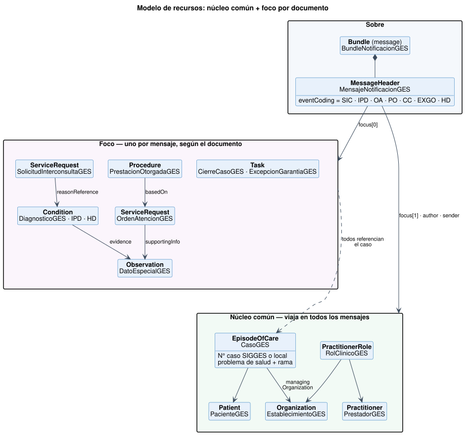

# Modelo de datos - Notificación de Casos GES a SIGGES 2.0 v0.4.0

* [**Table of Contents**](toc.md)
* **Modelo de datos**

## Modelo de datos

### Vista general

### Núcleo común

Estos recursos viajan en **todos** los mensajes. Resuelven de una sola vez los campos que la API v1.5 repite en cada documento.

| | | |
| :--- | :--- | :--- |
| [PacienteGES](StructureDefinition-paciente-ges.md) | NID`MINSALPaciente` | runPaciente, dvPaciente, nombres, apellidos, sexo, fecha de nacimiento, dirección, comuna, región, fono, email |
| [PrestadorGES](StructureDefinition-prestador-ges.md) | CL Core`CorePrestadorCl`, con la regla de identificador de NID (D-003) | runProfesional, dvProfesional, nombres y apellidos del profesional |
| [EstablecimientoGES](StructureDefinition-establecimiento-ges.md) | NID`MINSALPrestadorOrganizacional` | deisOrigen, deisEstablecimientoOtorga/Destino, tipoDeisOrigen. El Servicio de Salud**se deriva del catálogo** |
| [RolClinicoGES](StructureDefinition-rol-clinico-ges.md) | CL Core`CoreRolClinicoCl` | Quién (profesional), dónde (establecimiento que otorga) y en qué especialidad (especialidadOrigen) |
| [CasoGES](StructureDefinition-caso-ges.md) | EpisodeOfCare | problemaSalud, ramaProblemaSalud (obligatoria, D-020), número de caso SIGGES o local, estado del caso; programa GES en SNOMED CT opcional |

La identidad sigue la jerarquía del portafolio: FHIR R4 → CL Core → **NID** → esta guía. El paciente y el establecimiento derivan de los perfiles de NID, igual que en las guías de Laboratorio e Imagenología. El profesional queda en CL Core porque el perfil de NID es el del registro de prestadores y exige datos que la API v1.5 no trae (fecha de nacimiento, título); de NID se adopta la forma de identificarlo: RUN oficial, con su tipo y su sistema.

### Foco por documento

| | | |
| :--- | :--- | :--- |
| [DiagnosticoGES](StructureDefinition-diagnostico-ges.md) | CL Core`CoreDiagnosticoCl` | Base de SIC (motivo), IPD y HD.`verificationStatus`= confirma / sospecha / descarta |
| [InformeProcesoDiagnosticoGES](StructureDefinition-ipd-ges.md) | DiagnosticoGES | + establecimiento de destino; datos por PS en`evidence.detail` |
| [HojaDiariaGES](StructureDefinition-hoja-diaria-ges.md) | DiagnosticoGES | + estado de hoja diaria (específico por rama) |
| [SolicitudInterconsultaGES](StructureDefinition-sic-ges.md) | ServiceRequest | derivadaPara en`category`; destino en`performer`y`performerType` |
| [OrdenAtencionGES](StructureDefinition-oa-ges.md) | ServiceRequest | prestación en`code`; garantía en extensión; datos especiales en`supportingInfo` |
| [PrestacionOtorgadaGES](StructureDefinition-po-ges.md) | Procedure | `performedPeriod`= fechaRealizacion / fechaFin;`basedOn`→ OA |
| [CierreCasoGES](StructureDefinition-cierre-caso-ges.md) | Task | causal en`statusReason`;`focus`→ caso |
| [ExcepcionGarantiaGES](StructureDefinition-excepcion-garantia-ges.md) | Task | garantía en extensión; causal y justificación en`statusReason` |
| [GarantiaOportunidadGES](StructureDefinition-garantia-oportunidad-ges.md) | Task | La publica SIGGES; plazo en`restriction.period` |
| [DatoEspecialGES](StructureDefinition-dato-especial-ges.md) | Observation | Mecanismo de crecimiento por problema de salud |

### Extensiones (solo 5)

| | | |
| :--- | :--- | :--- |
| [ExtCasoGES](StructureDefinition-ext-caso-ges.md) | ServiceRequest, Procedure, Condition | En R4 estos recursos no tienen referencia al episodio |
| [ExtGarantiaGES](StructureDefinition-ext-garantia-ges.md) | ServiceRequest, Procedure, Task | Concepto propio del GES |
| [ExtIndicacionesClinicas](StructureDefinition-ext-indicaciones-clinicas.md) | Condition | Texto libre de tratamiento e indicaciones (indicacionExamen) |
| [ExtEstablecimientoDestino](StructureDefinition-ext-establecimiento-destino.md) | Condition | Destino de la atención tras el IPD |
| [ExtEstadoHojaDiaria](StructureDefinition-ext-estado-hoja-diaria.md) | Condition | Estado HD específico por rama (catálogo ESTADOS HD) |

### Cómo crece el modelo

| | | |
| :--- | :--- | :--- |
| Nuevo dato para un problema de salud (p.ej. estadio TNM, HbA1c, peso) | Se agrega un código a[CSDatoEspecialGES](CodeSystem-dato-especial-ges.md)y se envía como Observation | Perfiles, API y demás documentos |
| Nuevo documento SIGGES | Se agrega un código a[CSTipoDocumentoSIGGES](CodeSystem-tipo-documento-sigges.md)y un perfil de foco delgado | Núcleo común, sobre y respuesta |
| Nuevo decreto GES (ramas, garantías) | Se regeneran los CodeSystems desde el catálogo (`tools/catalogo2fsh.py`), con vigencia por concepto | Instancias ya emitidas |
| Codificación clínica (CIE-10, SNOMED CT) | Se agrega un`coding`adicional en`Condition.code`(slice`cie10`ya disponible) | El problema de salud GES sigue obligatorio |
| FONASA expone un endpoint FHIR | Los establecimientos siguen enviando**el mismo Bundle**y se retira el traductor | Todo lo que emite el establecimiento |
| Reportes y analítica | Los recursos son clínicos estándar: se pueden reutilizar en la Historia Clínica Compartida o en un repositorio | — |

> **Regla de oro.** Si un requerimiento nuevo lleva a agregar un campo a un perfil existente, antes hay que preguntarse si es un **dato clínico** (Observation), un **código** (CodeSystem) o un **documento** (evento nuevo).

