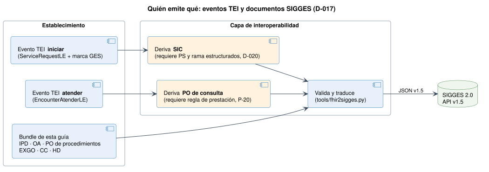

# Relación con TEI - Notificación de Casos GES a SIGGES 2.0 v0.4.0

* [**Table of Contents**](toc.md)
* **Relación con TEI**

## Relación con TEI

Esta página explica cómo se relaciona esta guía con la guía **Tiempos de Espera Interoperable** ([TEI 0.2.3](https://interoperabilidad.minsal.cl/fhir/ig/tei/0.2.3/index.html), `hl7.fhir.cl.minsal.tei`) y con el plan **TEI-GES** del equipo TEI. Las decisiones están en `decisiones.md` (D-017 a D-021) y los temas abiertos en `pendientes-0.4.0.md` (P-19 a P-23).

> **En resumen.** TEI es la puerta de la interconsulta y esta guía es la notificación del caso GES a SIGGES. No compiten: SIGGES consume los eventos de TEI (D-017) y esta guía agrega lo que TEI no tiene. Para que eso funcione, TEI tiene que entregar el problema de salud y la rama estructurados (D-020).

### Lo que ya calza

| | | |
| :--- | :--- | :--- |
| Transporte | `Bundle``message`+`MessageHeader.eventCoding`+`$process-message` | Igual (D-001) |
| Respuesta | `MessageHeader`+`OperationOutcome`; HTTP 200 / 4xx / 5xx | Igual, con`response.code`y número de caso |
| Establecimiento | DEIS de 6 dígitos | DEIS de 6 dígitos con DEIS2 derivado para SIGGES (D-004) |
| Problema de salud | Códigos 1–90 en`cs-problema-ges-tei` | Mismos códigos 1–90 en`CSProblemaSaludGES` |
| Diagnóstico | `ConditionDiagnosticoLE`con`verificationStatus` | `DiagnosticoGES`:`verificationStatus`= confirma / sospecha / descarta |

### Lo que SIGGES necesita y TEI 0.2.3 no entrega

| | | |
| :--- | :--- | :--- |
| Problema de salud estructurado | Respuesta de un`QuestionnaireResponse`(motivo de derivación) | `CasoGES.type[problemaSalud]`(FONASA, obligatorio) +`type[programaGES]`(SNOMED CT, opcional) |
| **Rama**(obligatoria en SIC, IPD y HD) | No existe: el subproblema es texto libre; los CodeSystems de rama están comentados | `CasoGES.type[rama]``1..1`(D-020) |
| Número de caso | No existe | `CasoGES.identifier`SIGGES / local |
| Derivada para | Códigos 1–5 propios | [ConceptMap](ConceptMap-tei-a-sigges-derivado-para.md):**2, 3 y 4 están cruzados** |
| Especialidad | Códigos numéricos (18 = Gastroenterología adulto) | [ConceptMap](ConceptMap-tei-a-sigges-especialidad.md)al formato`07-105-2` |
| Código de prestación de la PO | El`Encounter`de atención no lo trae | Pendiente de regla (P-20) |
| IPD, OA, EXGO, CC | No existen | Perfiles propios |
| Cierre del caso | Motivo de cierre**de la interconsulta** | Cierre de caso con causal;[ConceptMap](ConceptMap-tei-a-sigges-motivo-cierre.md)sólo para los motivos que también cierran el caso |

### Quién emite qué (D-017)

* La **SIC** se deriva del evento TEI `iniciar` cuando la interconsulta corresponde a GES. Las interconsultas que no pasan por TEI (secundaria a secundaria, prestadores privados) siguen usando [SolicitudInterconsultaGES](StructureDefinition-sic-ges.md).
* La **PO de la consulta de especialidad** se deriva del evento TEI `atender`.
* Todo lo demás (IPD, OA y PO de procedimientos, EXGO, CC y HD) se emite con esta guía.

### Por qué no se derivan los perfiles de TEI (D-018)

`ServiceRequestLE` fija `status = #draft`, amarra `reasonCode` a los códigos de «derivado para» de TEI y exige el estado de la interconsulta. Si la SIC de SIGGES derivara de ese perfil, quedaría en borrador para siempre y heredaría códigos que en SIGGES significan otra cosa. Por eso los perfiles son independientes y la correspondencia se declara con ConceptMaps.

### ConceptMaps TEI → SIGGES (D-019)

Se generan con `tools/tei2sigges.py` desde la terminología del repositorio TEI. No se inventan equivalencias: se mapea por código idéntico, por nombre exacto o con una tabla revisada a mano.

* Problema de salud: 90 códigos TEI, 90 iguales, 0 con nombre distinto.
* Derivado para: 5 de 5 mapeados; 2, 3 y 4 cruzados; SIGGES 11 sin origen en TEI.
* Especialidad: 76 códigos TEI, 38 con equivalente por nombre, 38 pendientes de homologación (P-21).
* Motivo de cierre: 18 motivos TEI, 2 equivalentes, 2 inexactos, el resto sin equivalente.
* [Problema de salud](ConceptMap-tei-a-sigges-problema-salud.md)
* [Derivado para](ConceptMap-tei-a-sigges-derivado-para.md)
* [Especialidad](ConceptMap-tei-a-sigges-especialidad.md)
* [Motivo de cierre](ConceptMap-tei-a-sigges-motivo-cierre.md)

Los cuatro son `experimental`. Citan los CodeSystems de TEI por su URL canónica, sin declarar el paquete TEI como dependencia; el validador avisa que no los encuentra.

### Sobre el modelo TEI-GES (D-021)

El plan TEI-GES propone dos `EpisodeOfCare` (global y del prestador) y una extensión `gesProgramStatus`. Esta guía mantiene **un solo** `EpisodeOfCare` por caso:

* R4 no tiene un vínculo estándar entre dos episodios, así que el mismo caso terminaría con dos estados.
* El estado programático combina tres ejes que ya existen: el clínico (`Condition.verificationStatus`), el del episodio (`EpisodeOfCare.status`) y el de cada garantía (`Task.businessStatus`). Si se necesita, lo calcula SIGGES y lo publica en la [consulta de casos](consulta.md); el prestador no lo envía (P-22).
* En SIGGES un caso descartado sigue abierto hasta el cierre de caso con causal 8. Marcar el episodio `finished` al descartar crea dos fuentes de verdad.

### Pedidos al equipo TEI (P-19, P-23)

1. Llevar el problema de salud del`QuestionnaireResponse`a un elemento estructurado y agregar la rama codificada con el catálogo SIGGES.
1. Corregir la incoherencia de`cs-problema-ges-tei`(códigos 1–90) con`vs-problema-ges-tei`(conceptos SNOMED CT): el ejemplo de 0.2.3 envía un código SNOMED bajo el sistema 1–90.
1. Acordar qué pasa con la interconsulta GES: hoy TEI la cierra con el motivo 1 «GES (0)».
1. Acordar la regla del código de prestación para la PO derivada de la atención (P-20).

