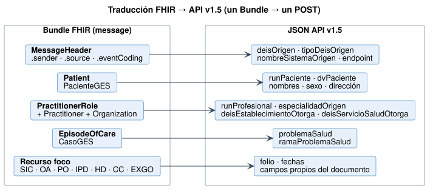

# Transición y traducción a API v1.5 - Notificación de Casos GES a SIGGES 2.0 v0.4.0

* [**Table of Contents**](toc.md)
* **Transición y traducción a API v1.5**

## Transición y traducción a API v1.5

### Dos etapas

| | | |
| :--- | :--- | :--- |
| El establecimiento envía | Bundle FHIR de esta guía | **El mismo**Bundle FHIR |
| Quién valida | Capa de interoperabilidad (nodo / nivel central) | SIGGES |
| Quién traduce | Canal en la capa de interoperabilidad (FHIR → JSON v1.5) | Nadie |
| Cambios en SIGGES | Ninguno | Endpoint`$process-message`y búsqueda de EpisodeOfCare |

Lo importante es que **el establecimiento integra una sola vez**. Cuando FONASA pase a FHIR nativo, se retira el traductor y ningún sistema de origen se entera.



### Traductor de referencia

`tools/fhir2sigges.py` es una **especificación ejecutable** del mapeo. Sirve como base para el canal de integración (Mirth, Camel u otro) y como caso de prueba.

```
# un mensaje
python3 tools/fhir2sigges.py fsh-generated/resources/Bundle-msg-a4-ipd.json

# todos los ejemplos → input/includes/api-v15/*.json
python3 tools/fhir2sigges.py --ejemplos

```

Qué resuelve:

* **Fechas** ISO 8601 → `DD/MM/AAAA` y `HH:MM`.
* **RUN** `12345678-5` → `runPaciente` + `dvPaciente`.
* **Servicio de Salud** derivado del DEIS con el catálogo.
* **Sexo** y **confirmaSospechaDescarta** por ConceptMap.
* **Datos especiales**: Observation `vfg` → `enfermedadRenalVfg1`; `cuarto-turno` → `cuartoTurnoEspecial`.
* **Datos del beneficiario ERC**: Patient → `comunaEspecial`, `regionEspecial`, `fonoBeneficiarioEspecial` y `emailBeneficiarioEspecial`.
* **Diferencias de nombres de la API**: `nombrePaciente` (SIC), `pscCasoPaci` (EXGO).

**Resultado sobre los 15 mensajes de ejemplo: 0 campos obligatorios faltantes en los 7 endpoints.**

### Respuesta

El canal convierte la respuesta HTTP de SIGGES en un [BundleRespuestaGES](StructureDefinition-bundle-respuesta-ges.md):

| | | |
| :--- | :--- | :--- |
| 2xx con N° de caso | `ok` | — (o`information`) |
| 2xx "ya registrado" | `ok` | `warning`/`duplicate` |
| 4xx validación | `fatal-error` | `error`con`expression` |
| 5xx / timeout | `transient-error` | `error`/`timeout` |

### Recomendaciones de implementación

1. **Validar antes de traducir.**Un Bundle que no cumple los perfiles nunca debe llegar a SIGGES.
1. **Registrar el par (Bundle.identifier, folio) → respuesta**, para reintentos y auditoría.
1. **Cachear el token OAuth**hasta su expiración; no pedir uno por mensaje.
1. **Cola con reintentos**exponenciales solo para`transient-error`.
1. **Tablero de rechazos por establecimiento y regla**, para retroalimentar a los equipos locales.

